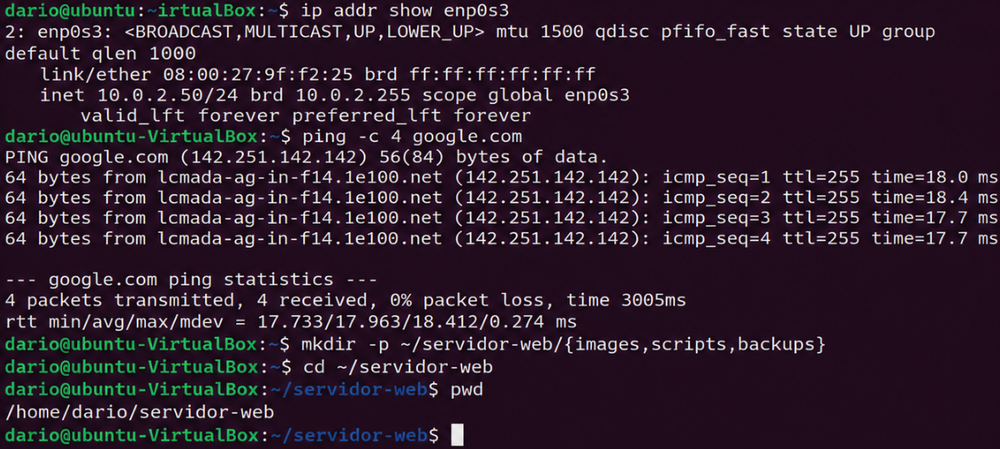
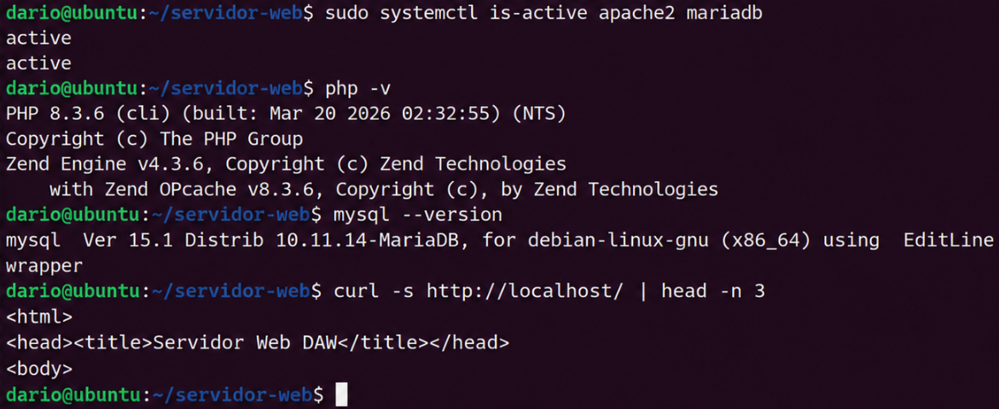
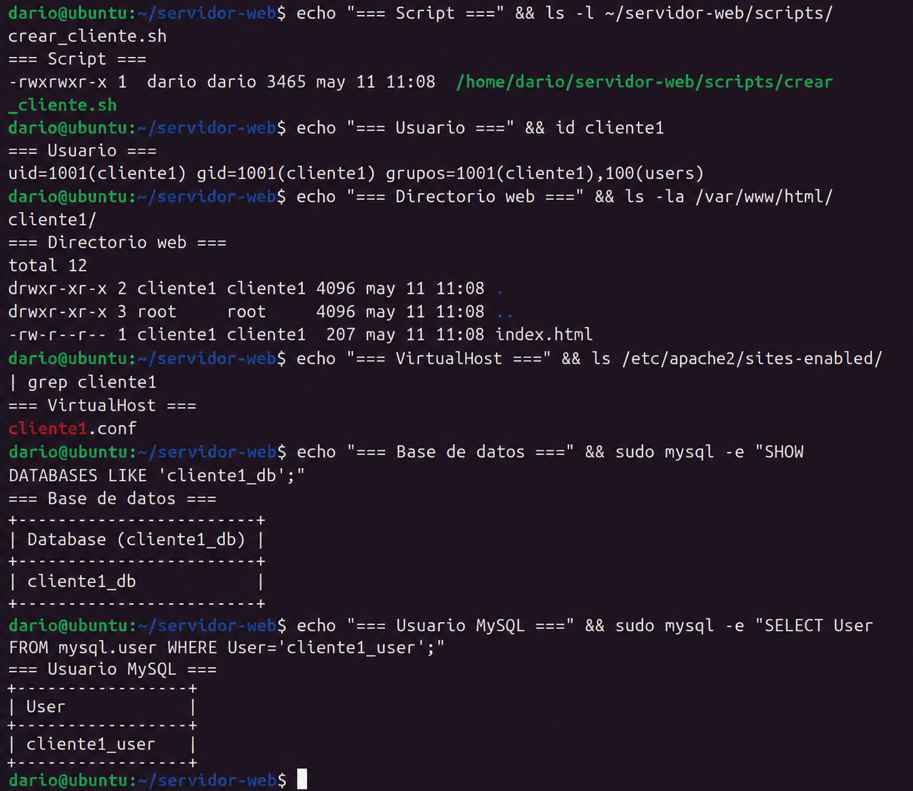
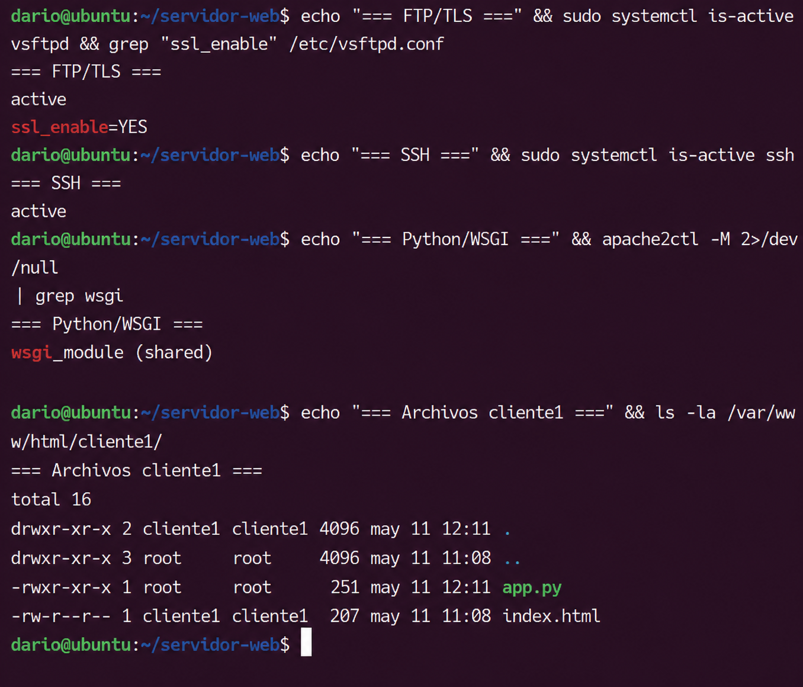
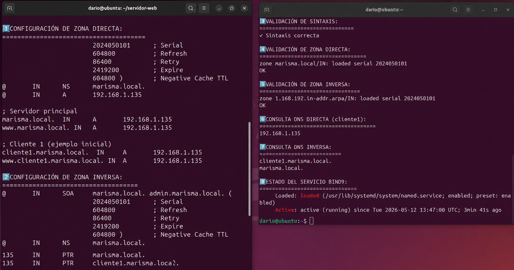
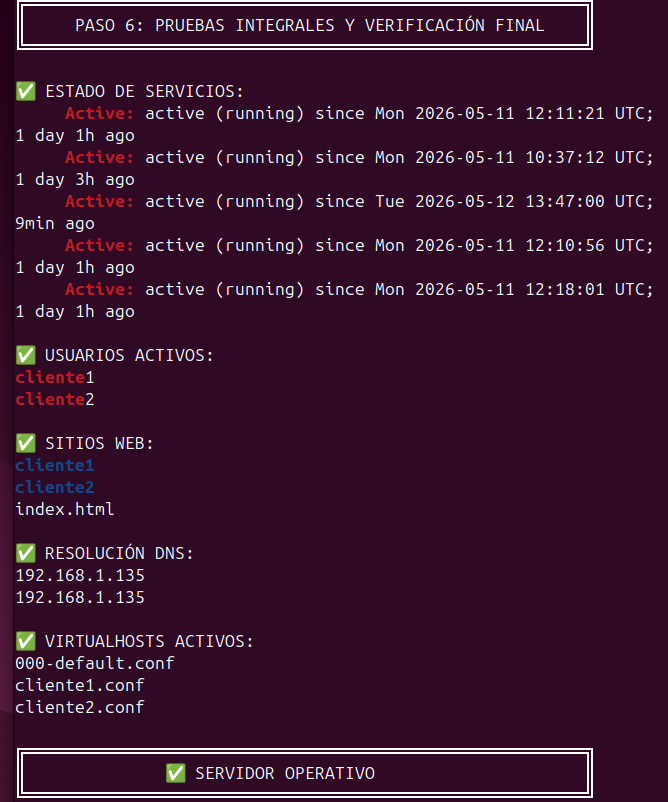

# Servidor de Alojamiento Web 

---

## Indice

1. [Descripcion general](#1-descripcion-general)
2. [Preparacion del entorno](#2-preparacion-del-entorno)
3. [Instalacion del stack LAMP y phpMyAdmin](#3-instalacion-del-stack-lamp-y-phpmyadmin)
4. [Script de creacion automatica de clientes](#4-script-de-creacion-automatica-de-clientes)
5. [Acceso FTP con TLS y acceso SSH/SFTP](#5-acceso-ftp-con-tls-y-acceso-sshsftp)
6. [Servidor DNS con BIND9](#6-servidor-dns-con-bind9)
7. [Verificacion global del sistema](#7-verificacion-global-del-sistema)
8. [Resumen de criterios cumplidos](#8-resumen-de-criterios-cumplidos)

---

## 1. Descripcion general

El objetivo de esta practica es desplegar un servidor de alojamiento web completo sobre Ubuntu 24.04 ejecutado en VirtualBox con red en modo puente. El servidor es capaz de alojar paginas web estaticas y dinamicas (PHP y Python), gestionar bases de datos MySQL por cliente, ofrecer acceso FTP cifrado con TLS, acceso remoto via SSH/SFTP, y resolver nombres de dominio mediante un servidor DNS autoritario local (BIND9).

Toda la alta de nuevos clientes esta automatizada a traves del script `crear_cliente.sh`, que en una sola ejecucion crea el usuario del sistema, el directorio web, el VirtualHost de Apache, el subdominio DNS con resolucion directa e inversa, y la base de datos con su usuario MySQL.

La estructura del repositorio es la siguiente:

```
~/servidor-web/
├── scripts/
│   └── crear_cliente.sh
├── backups/
└── images/
```

---

## 2. Preparacion del entorno

Antes de instalar ningun servicio se actualiza el sistema operativo y se instalan las herramientas de red basicas. Tambien se configura la direccion IP estatica del servidor y se verifica la conectividad tanto local como con el exterior.

```bash
sudo apt update && sudo apt upgrade -y
sudo apt install -y net-tools vim curl wget git
ip addr show
ping -c 4 8.8.8.8
mkdir -p ~/servidor-web/{scripts,backups,images}
```

La IP estatica se asigna a traves de Netplan editando `/etc/netplan/00-installer-config.yaml` y ejecutando `sudo netplan apply`. De esta forma la IP `192.168.1.135` queda fija y los servicios que dependen de ella (DNS, FTP pasivo, VirtualHosts) funcionan de manera estable entre reinicios.

<!-- FOTO 1: captura que muestre la actualizacion del sistema y/o la salida de "ip addr show" con la IP estatica ya asignada y la estructura de directorios creada -->


---

## 3. Instalacion del stack LAMP y phpMyAdmin

El servidor web se basa en el stack LAMP: Linux, Apache2, MariaDB y PHP. Ademas se instala phpMyAdmin para la administracion grafica de bases de datos desde el navegador.

### 3.1 Instalacion de paquetes

```bash
sudo apt install -y apache2 php php-cli php-mysql php-curl php-gd \
  php-mbstring php-xml php-zip libapache2-mod-php \
  mariadb-server mariadb-client phpmyadmin
```

### 3.2 Activacion de servicios y modulos de Apache

```bash
sudo systemctl enable apache2 mariadb
sudo systemctl start apache2 mariadb
sudo a2enmod rewrite ssl
sudo systemctl restart apache2
```

El modulo `rewrite` permite el uso de `.htaccess` en los VirtualHosts de cada cliente, mientras que `ssl` habilita soporte HTTPS si se necesita en el futuro.

### 3.3 Enlace de phpMyAdmin con Apache

phpMyAdmin instala su configuracion en `/etc/phpmyadmin/apache.conf`. Para que Apache la reconozca hay que enlazarla en `conf-available` y habilitarla:

```bash
sudo ln -sf /etc/phpmyadmin/apache.conf /etc/apache2/conf-available/phpmyadmin.conf
sudo a2enconf phpmyadmin
sudo systemctl reload apache2
```

Tras esto phpMyAdmin queda accesible en `http://192.168.1.135/phpmyadmin`. Cada cliente puede administrar su base de datos desde el navegador con su propio usuario MySQL.

### 3.4 Soporte para aplicaciones Python (mod_wsgi)

Para que Apache pueda ejecutar aplicaciones Python se instala el modulo `mod_wsgi` para Python 3 y se activa:

```bash
sudo apt install -y libapache2-mod-wsgi-py3
sudo a2enmod wsgi
sudo systemctl restart apache2
```

Con este modulo activo, cada VirtualHost puede declarar una directiva `WSGIScriptAlias` que mapea una ruta URL a un archivo `.py` con la interfaz WSGI. Esto permite alojar aplicaciones Python junto a las paginas PHP sin conflictos.

<!-- FOTO 2: captura que muestre Apache activo (systemctl status apache2), phpMyAdmin accesible en el navegador, y/o la version de PHP con php -v -->


---

## 4. Script de creacion automatica de clientes

El nucleo de la automatizacion es el script `crear_cliente.sh`. Recibe dos parametros: el nombre del cliente y la IP del servidor. Con una unica llamada realiza todas las operaciones necesarias para dar de alta a un nuevo cliente.

### 4.1 Operaciones que realiza el script

1. **Crea el usuario del sistema** con `useradd`, lo que le permite acceder por FTP (vsftpd) y SSH.
2. **Crea el directorio web** `/var/www/html/<cliente>/` con una pagina `index.html` por defecto que muestra el nombre del subdominio y la version de PHP.
3. **Genera el VirtualHost de Apache** en `/etc/apache2/sites-available/<cliente>.marisma.conf` siguiendo la plantilla del enunciado, con `ServerName`, `DocumentRoot`, logs individuales y soporte para `.htaccess`.
4. **Activa el VirtualHost** con `a2ensite` y recarga Apache.
5. **Inyecta registros DNS** en `/etc/bind/db.marisma.local` (registro A) y en `/etc/bind/db.192` (registro PTR para resolucion inversa), incrementa el serial de la zona y recarga BIND9.
6. **Crea la base de datos MySQL** `<cliente>_db` y el usuario `<cliente>_user` con contraseña generada aleatoriamente (`openssl rand -base64 12`) y `GRANT ALL PRIVILEGES` sobre dicha base de datos.

### 4.2 Uso del script

```bash
chmod +x ~/servidor-web/scripts/crear_cliente.sh
sudo ~/servidor-web/scripts/crear_cliente.sh cliente1 192.168.1.135
```

### 4.3 Verificacion tras la ejecucion

```bash
# Usuario del sistema creado
id cliente1

# Directorio web con index.html
ls -la /var/www/html/cliente1/

# VirtualHost habilitado
ls /etc/apache2/sites-enabled/ | grep cliente1

# Base de datos y usuario MySQL
sudo mysql -e "SHOW DATABASES LIKE 'cliente1_db';"
sudo mysql -e "SELECT User FROM mysql.user WHERE User='cliente1_user';"
sudo mysql -e "SHOW GRANTS FOR 'cliente1_user'@'localhost';"
```

<!-- FOTO 3: captura que muestre la ejecucion del script crear_cliente.sh con su salida por consola, y/o alguna de las verificaciones anteriores (id cliente1, SHOW DATABASES, VirtualHost habilitado) -->


---

## 5. Acceso FTP con TLS y acceso SSH/SFTP

### 5.1 FTP seguro con vsftpd y TLS

Se instala vsftpd como servidor FTP y se configura con cifrado TLS para proteger tanto las credenciales como los datos en transito:

```bash
sudo apt install -y vsftpd
```

Parametros clave en `/etc/vsftpd.conf`:

```
ssl_enable=YES
rsa_cert_file=/etc/ssl/certs/ssl-cert-snakeoil.pem
rsa_private_key_file=/etc/ssl/private/ssl-cert-snakeoil.key
force_local_logins_ssl=YES
force_local_data_ssl=YES
chroot_local_user=YES
pasv_enable=YES
pasv_address=192.168.1.135
pasv_min_port=40000
pasv_max_port=40100
```

La directiva `chroot_local_user=YES` confina a cada usuario dentro de su directorio home, de modo que un cliente no puede navegar por el sistema de archivos del servidor. El modo pasivo con `pasv_address` es necesario para que clientes FTP detras de NAT puedan conectarse correctamente.

```bash
sudo systemctl enable vsftpd
sudo systemctl restart vsftpd
sudo ufw allow 21/tcp
sudo ufw allow 40000:40100/tcp
```

### 5.2 Acceso SSH y SFTP

OpenSSH se instala por defecto en Ubuntu. Solo es necesario asegurarse de que el servicio esta activo y que el puerto 22 esta permitido en el firewall:

```bash
sudo systemctl enable ssh
sudo systemctl start ssh
sudo ufw allow 22/tcp
```

Los usuarios del sistema creados por el script tienen acceso SSH y SFTP con sus credenciales. SFTP utiliza el mismo puerto que SSH (22) y permite la transferencia segura de archivos sin necesidad de un servidor FTP independiente.

```bash
# Conexion SSH
ssh cliente1@192.168.1.135

# Conexion SFTP
sftp cliente1@192.168.1.135

# Verificar puertos en escucha
sudo netstat -tlnp | grep -E "21|22"
```

<!-- FOTO 4: captura que muestre vsftpd activo con TLS (systemctl status vsftpd o configuracion ssl en vsftpd.conf), conexion FTP o SSH funcional, y/o los puertos 21 y 22 en escucha -->


---

## 6. Servidor DNS con BIND9

### 6.1 Instalacion

```bash
sudo apt install -y bind9 bind9-utils dnsutils
sudo systemctl enable named
sudo systemctl start named
```

### 6.2 Configuracion de zonas en named.conf.local

Se definen dos zonas en `/etc/bind/named.conf.local`:

- **Zona directa** `marisma.local`: resuelve nombres a IPs (registros A).
- **Zona inversa** `1.168.192.in-addr.arpa`: resuelve IPs a nombres (registros PTR).

```
zone "marisma.local" {
    type master;
    file "/etc/bind/db.marisma.local";
};

zone "1.168.192.in-addr.arpa" {
    type master;
    file "/etc/bind/db.192";
};
```

### 6.3 Archivo de zona directa (/etc/bind/db.marisma.local)

El archivo contiene los registros SOA (autoridad de la zona), NS (servidor de nombres), y A (direcciones) del servidor y de cada cliente. El script `crear_cliente.sh` anade automaticamente un nuevo registro A cada vez que se crea un cliente.

### 6.4 Archivo de zona inversa (/etc/bind/db.192)

Contiene los registros PTR que permiten resolver una IP a su nombre de dominio. El script tambien inyecta aqui el registro PTR correspondiente al crear cada cliente.

### 6.5 Validacion y pruebas

```bash
# Validar sintaxis de configuracion
sudo named-checkconf

# Validar archivos de zona
sudo named-checkzone marisma.local /etc/bind/db.marisma.local
sudo named-checkzone 1.168.192.in-addr.arpa /etc/bind/db.192

# Resolucion directa del servidor
dig @192.168.1.135 marisma.local

# Resolucion directa de un cliente
dig @192.168.1.135 cliente1.marisma.local

# Resolucion inversa
dig @192.168.1.135 -x 192.168.1.135
```

<!-- FOTO 5: captura que muestre la salida de dig con resolucion directa (cliente1.marisma.local -> 192.168.1.135) y/o resolucion inversa funcionando, o named-checkzone con resultado OK -->


---

## 7. Verificacion global del sistema

Una vez configurados todos los servicios se realiza una bateria de pruebas para confirmar el funcionamiento integrado del servidor.

### Estado de todos los servicios

```bash
sudo systemctl status apache2 mariadb named vsftpd ssh
```

Los cinco servicios deben aparecer como `active (running)`.

### Creacion de un segundo cliente para comprobar el script

```bash
sudo ~/servidor-web/scripts/crear_cliente.sh cliente2 192.168.1.135

# Verificaciones
id cliente2
ls /var/www/html/cliente2/
dig @192.168.1.135 cliente2.marisma.local +short
sudo mysql -e "SHOW DATABASES LIKE 'cliente2_db';"
curl -s http://192.168.1.135 -I | head -3
```

### Verificacion del modulo Python/WSGI

```bash
sudo apache2ctl -M | grep wsgi
```

### Verificacion de phpMyAdmin

```bash
curl -s -o /dev/null -w "HTTP %{http_code}\n" http://192.168.1.135/phpmyadmin
```

### Verificacion de configuracion FTP con TLS

```bash
sudo grep -E "ssl_enable|chroot_local_user|pasv_address" /etc/vsftpd.conf
```

<!-- FOTO 6: captura que muestre los cinco servicios activos (systemctl status), o la creacion de cliente2 con el script funcionando correctamente, o varias de las verificaciones anteriores en una misma terminal -->


---

## 8. Resumen de criterios cumplidos

A continuacion se relaciona cada requisito del enunciado con la solucion implementada:

| Requisito del enunciado | Solucion implementada |
|---|---|
| Alojamiento de paginas estaticas y dinamicas con PHP | Apache2 + PHP 8.3 con modulos mysql, curl, gd, mbstring, xml, zip |
| Directorio de usuario con pagina web por defecto | El script crea `/var/www/html/<cliente>/index.html` automaticamente |
| Base de datos SQL administrable con phpMyAdmin | MariaDB con BD independiente por cliente; phpMyAdmin en `/phpmyadmin` |
| Acceso FTP con TLS | vsftpd con `ssl_enable=YES`, `force_local_logins_ssl=YES`, modo pasivo configurado |
| Acceso SSH y SFTP | OpenSSH activo en puerto 22; todos los usuarios del sistema tienen acceso |
| Script: creacion de usuario y directorio web | `crear_cliente.sh` crea usuario con `useradd` y directorio con `mkdir` |
| Script: host virtual en Apache | El script genera el archivo `.marisma.conf` y ejecuta `a2ensite` |
| Script: usuario del sistema para FTP/SSH | El usuario del sistema creado tiene acceso a ambos servicios |
| Script: subdominio DNS con resolucion directa e inversa | Inyeccion de registros A y PTR en BIND9 con incremento de serial |
| Script: base de datos con usuario ALL PRIVILEGES | Creacion de BD y `GRANT ALL PRIVILEGES` con contrasena aleatoria |
| Ejecucion de aplicaciones Python | `mod_wsgi` instalado y activo; soporte WSGI en Apache2 |

---

## Informacion tecnica del entorno

| Componente | Version | Puerto |
|---|---|---|
| Apache2 | 2.4.x | 80 |
| PHP | 8.3 | - |
| MariaDB | 10.11.x | 3306 |
| BIND9 | 9.18.x | 53 |
| vsftpd | 3.0.x | 21 (datos: 40000-40100) |
| OpenSSH | 8.9.x | 22 |
| mod_wsgi | 4.9.x | - |

### Archivos de configuracion principales

```
/etc/apache2/sites-available/     -> VirtualHost de cada cliente
/etc/bind/named.conf.local        -> Definicion de zonas DNS
/etc/bind/db.marisma.local        -> Zona directa
/etc/bind/db.192                  -> Zona inversa
/etc/vsftpd.conf                  -> Configuracion FTP con TLS
/etc/ssh/sshd_config              -> Configuracion OpenSSH
/etc/mysql/mariadb.conf.d/        -> Configuracion MariaDB
```

---

**Fecha de entrega:** 30 de abril de 2025  
**Estado:** Completado y operativo
**Autor:** Jose Darío Alfaro Santos 
**Centro:** IES La Marisma  
**Sistema operativo:** Ubuntu Desktop 24.04 LTS en VirtualBox (Adaptador Puente)  
**IP del servidor:** 192.168.1.135  
**Dominio local:** marisma.local 
