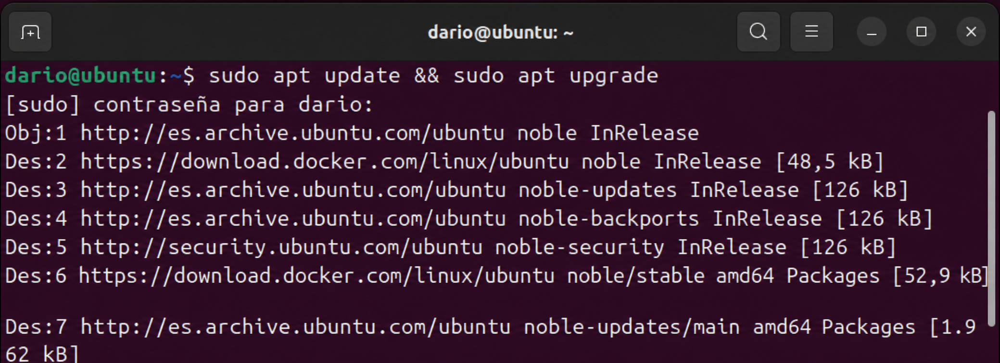
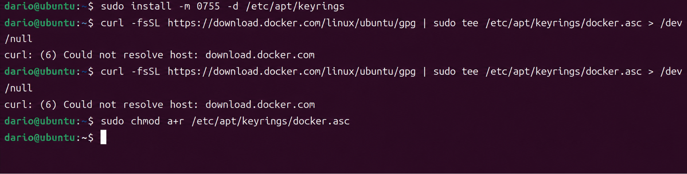
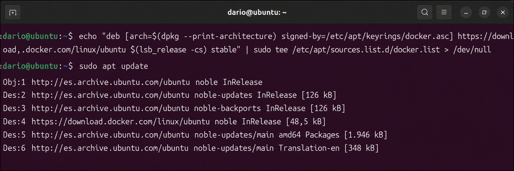
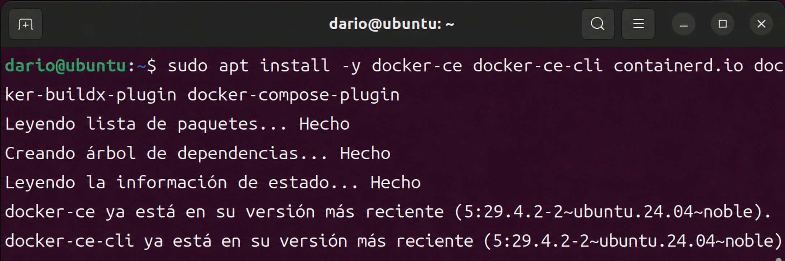
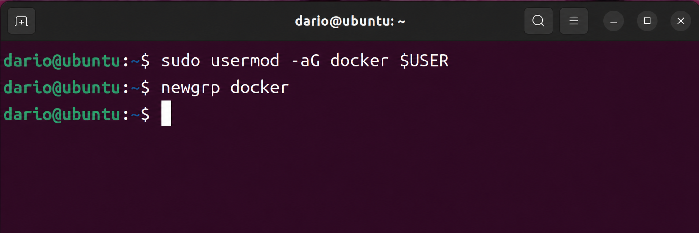
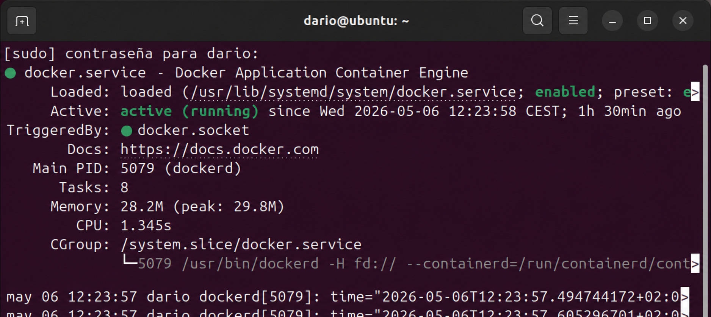
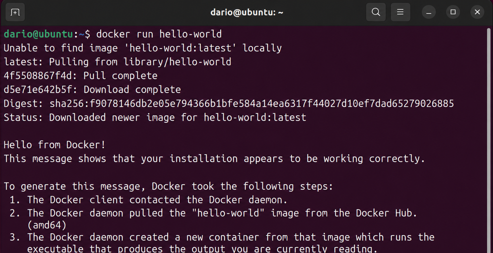

# Actividad 1 - Instalacion de Docker en Ubuntu

## Descripcion

En esta actividad se documenta el proceso de instalacion de Docker Community Edition (Docker CE) sobre un sistema Ubuntu 24 LTS. Aunque los articulos de referencia describen el proceso para Ubuntu 16.04, los pasos son practicamente equivalentes en versiones modernas de Ubuntu, ya que el metodo de instalacion mediante repositorio oficial de Docker se mantiene consistente entre versiones.

**Sistema operativo utilizado:** Ubuntu 24 LTS  
**Version de Docker instalada:** Docker CE (Community Edition)  
**Fuentes consultadas:**
- Documentacion oficial: https://docs.docker.com/install/linux/docker-ce/ubuntu/
- Guia complementaria: https://medium.com/@Grigorkh/how-to-install-docker-on-ubuntu-16-04-3f509070d29c
- Tutorial adicional: https://www.tecmint.com/install-docker-and-run-docker-containers-in-ubuntu/

---

## Por que Docker CE y no Docker Desktop

Docker CE es la version de motor de contenedores orientada a servidores Linux. A diferencia de Docker Desktop (que incluye interfaz grafica y esta pensado para Windows/macOS), Docker CE se instala directamente sobre el sistema operativo sin capa de virtualizacion adicional, lo que lo hace la opcion adecuada para entornos de servidor Ubuntu.

---

## Proceso de instalacion

Todos los comandos que modifican el sistema requieren privilegios de administrador, por lo que se antepone `sudo` en cada uno de ellos. Es importante seguir el orden indicado ya que algunos pasos dependen de los anteriores.

---

### Paso 1 - Actualizar los paquetes del sistema

Antes de instalar cualquier software nuevo, es una buena practica actualizar el indice de paquetes y aplicar las actualizaciones pendientes. Esto evita conflictos de dependencias y asegura que el sistema tenga los repositorios en su estado mas reciente.

```bash
sudo apt update && sudo apt upgrade -y
```

El parametro `-y` confirma automaticamente todas las preguntas del instalador para no interrumpir el proceso.



---

### Paso 2 - Instalar dependencias previas

Docker no se instala desde los repositorios oficiales de Ubuntu, sino desde el repositorio propio de Docker. Para poder agregar ese repositorio de forma segura, necesitamos instalar algunas herramientas:

- `ca-certificates`: permite que el sistema verifique certificados SSL/TLS
- `curl`: herramienta para realizar peticiones HTTP desde la terminal
- `gnupg`: gestor de claves GPG necesario para verificar la autenticidad del repositorio

```bash
sudo apt install -y ca-certificates curl gnupg
```



---

### Paso 3 - Agregar la clave GPG oficial de Docker

Los repositorios externos en sistemas Debian/Ubuntu se autentican mediante claves GPG. Descargamos la clave publica de Docker y la almacenamos en el directorio de keyrings del sistema, que es donde APT busca las claves de confianza.

```bash
sudo install -m 0755 -d /etc/apt/keyrings
curl -fsSL https://download.docker.com/linux/ubuntu/gpg | sudo tee /etc/apt/keyrings/docker.asc > /dev/null
sudo chmod a+r /etc/apt/keyrings/docker.asc
```

El primer comando crea el directorio con los permisos correctos (0755). El segundo descarga la clave y la guarda. El tercero ajusta los permisos para que todos los usuarios puedan leerla, lo que es necesario para que APT la utilice correctamente.



---

### Paso 4 - Agregar el repositorio oficial de Docker

Con la clave GPG ya instalada, ahora registramos el repositorio oficial de Docker en el sistema. El comando construye automaticamente la entrada correcta segun la arquitectura del procesador y la version de Ubuntu instalada (gracias a `dpkg --print-architecture` y `lsb_release -cs`).

```bash
echo "deb [arch=$(dpkg --print-architecture) signed-by=/etc/apt/keyrings/docker.asc] https://download.docker.com/linux/ubuntu $(lsb_release -cs) stable" | sudo tee /etc/apt/sources.list.d/docker.list > /dev/null
```

Una vez agregado el repositorio, actualizamos el indice de paquetes para que APT reconozca los paquetes de Docker:

```bash
sudo apt update
```



---

### Paso 5 - Instalar Docker CE y sus componentes

Con el repositorio registrado, ya podemos instalar Docker. Se instalan los siguientes componentes:

| Paquete | Funcion |
|---|---|
| `docker-ce` | Motor principal de Docker |
| `docker-ce-cli` | Herramienta de linea de comandos para interactuar con Docker |
| `containerd.io` | Runtime de contenedores de bajo nivel |
| `docker-buildx-plugin` | Plugin para construir imagenes multiplataforma |
| `docker-compose-plugin` | Plugin para orquestar multiples contenedores con Compose |

```bash
sudo apt install -y docker-ce docker-ce-cli containerd.io docker-buildx-plugin docker-compose-plugin
```



---

### Paso 6 - Configurar Docker para ejecutarlo sin sudo

Por defecto, el daemon de Docker solo puede ser utilizado por el usuario `root`. Para poder usar los comandos de Docker con nuestro usuario normal sin necesidad de anteponer `sudo` cada vez, debemos agregar nuestro usuario al grupo `docker` que se crea durante la instalacion.

```bash
sudo usermod -aG docker $USER
newgrp docker
```

`usermod -aG` agrega el usuario al grupo indicado sin quitarlo de sus grupos actuales. El comando `newgrp docker` aplica el cambio de grupo en la sesion actual sin necesidad de cerrar sesion.



---

### Paso 7 - Verificar que el servicio esta activo

Al instalar Docker CE, el servicio `docker` se configura automaticamente para iniciarse con el sistema. Comprobamos que esta en ejecucion con systemctl:

```bash
sudo systemctl status docker
```

La salida debe mostrar el estado `active (running)` en verde, lo que confirma que el daemon esta funcionando correctamente y arrancara automaticamente en cada inicio del sistema.



---

### Paso 8 - Verificar la instalacion con hello-world

El ultimo paso es confirmar que Docker puede descargar y ejecutar contenedores correctamente. Para ello se utiliza la imagen oficial `hello-world`, disenada especificamente para comprobar que toda la cadena de funcionamiento de Docker (daemon, cliente, registro, ejecucion) funciona sin errores.

```bash
docker run hello-world
```

> **Nota:** Si la imagen no esta descargada localmente, Docker la obtiene automaticamente desde Docker Hub. La salida del contenedor incluye un mensaje explicando los pasos que Docker realizo para ejecutar ese contenedor.


---

## Conclusion

Tras seguir estos pasos, Docker CE queda completamente instalado y operativo en Ubuntu 24. El proceso consistio en registrar el repositorio oficial de Docker con su clave de autenticacion GPG, instalar el motor junto con todos sus componentes necesarios, y configurar el usuario para poder operar con Docker sin privilegios de root. La prueba con `hello-world` confirmo que la instalacion es correcta y que Docker puede comunicarse con Docker Hub para descargar y ejecutar imagenes.
