# Practica 2 - Introduccion a los contenedores Docker

En esta practica se trabajan los conceptos fundamentales del modulo 3 del curso de Docker. Se documenta la creacion y gestion de contenedores usando la linea de comandos de Docker, partiendo de los ejemplos propuestos en el repositorio del curso.

---

## 1. El contenedor "Hola Mundo"

El primer paso para verificar que Docker esta correctamente instalado y funcionando es ejecutar el contenedor de prueba `hello-world`. Esta imagen esta alojada en Docker Hub y, al no tenerla localmente, Docker la descarga automaticamente antes de ejecutarla.

```bash
docker run hello-world
```


El contenedor imprime un mensaje de confirmacion y termina su ejecucion de inmediato, ya que su unico proposito es verificar que la instalacion funciona correctamente.

Para comprobar si hay contenedores en ejecucion en ese momento:

```bash
docker ps
```


El resultado esta vacio porque `hello-world` ya ha terminado. Para ver todos los contenedores, incluyendo los que ya han parado, se usa la opcion `-a`:

```bash
docker ps -a
```


En la salida aparece el contenedor con estado `Exited`. Se puede eliminar usando su ID o su nombre asignado automaticamente:

```bash
docker rm <id_contenedor>
```

o bien:

```bash
docker rm <nombre_contenedor>
```

---

## 2. Ejecucion simple de contenedores

Docker permite ejecutar un comando puntual dentro de un contenedor y que este termine automaticamente cuando ese comando finaliza. En este ejemplo se usa la imagen `ubuntu` para ejecutar el comando `echo`:

```bash
docker run ubuntu echo 'Hello World'
```

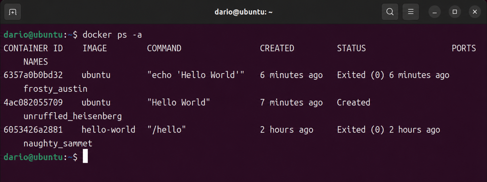

Como la imagen `ubuntu` no estaba descargada previamente, Docker la obtiene desde Docker Hub antes de lanzar el contenedor. Una vez ejecutado el comando, el contenedor se detiene.

Para confirmar que el contenedor ha terminado y aparece en el historial:

```bash
docker ps -a
```

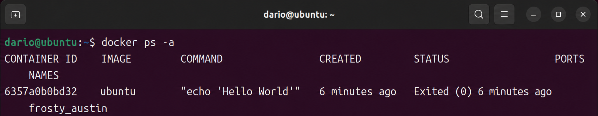

Para ver todas las imagenes que tenemos almacenadas localmente en nuestro registro:

```bash
docker images
```

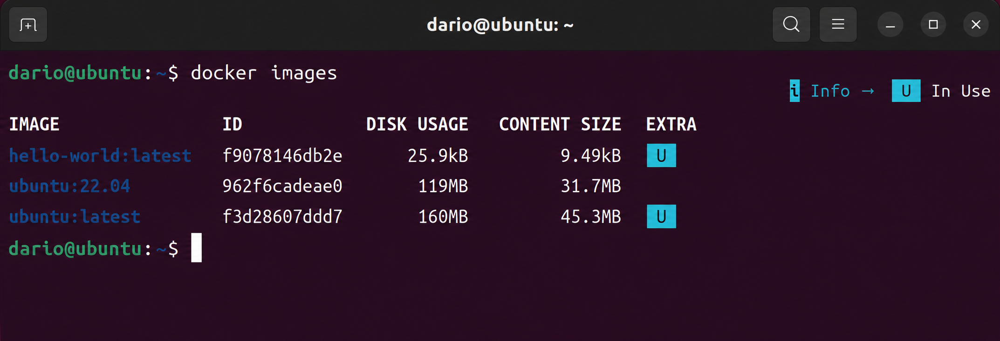

Aqui se puede ver tanto `hello-world` como `ubuntu`, con informacion sobre su tamano, el tag utilizado y la fecha de creacion.

---

## 3. Contenedor interactivo

Para trabajar dentro de un contenedor de forma interactiva se usan las opciones `-i` (mantener la entrada estandar abierta) y `-t` (asignar un pseudo-terminal). Esto permite interactuar con el contenedor como si fuera una sesion de terminal normal.

```bash
docker run -it --name contenedor1 ubuntu bash
```

- `-i`: sesion interactiva
- `-t`: pseudo-terminal
- `--name contenedor1`: asigna un nombre personalizado al contenedor
- `ubuntu`: imagen base
- `bash`: proceso a ejecutar dentro del contenedor

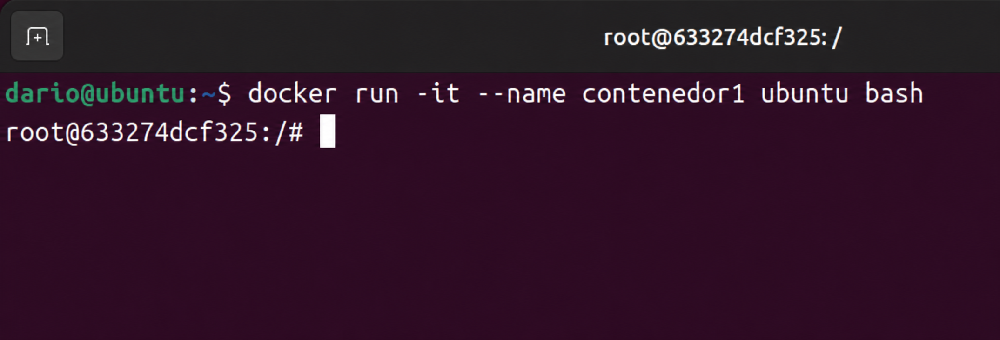

Al escribir `exit` dentro del contenedor, este se detiene. Para volver a iniciarlo y reconectarse:

```bash
docker start contenedor1
docker attach contenedor1
```

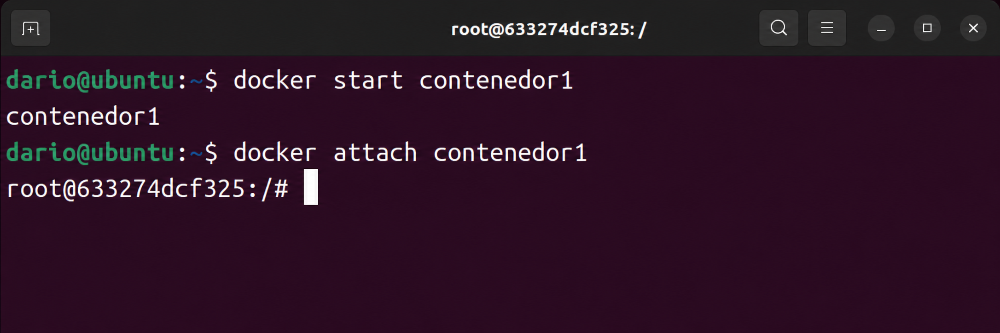

`docker start` arranca de nuevo el contenedor y `docker attach` reconecta la terminal local con el proceso principal del contenedor.

Si el contenedor esta en ejecucion, tambien es posible ejecutar comandos desde fuera sin necesidad de entrar en el:

```bash
docker exec contenedor1 ls -al
```

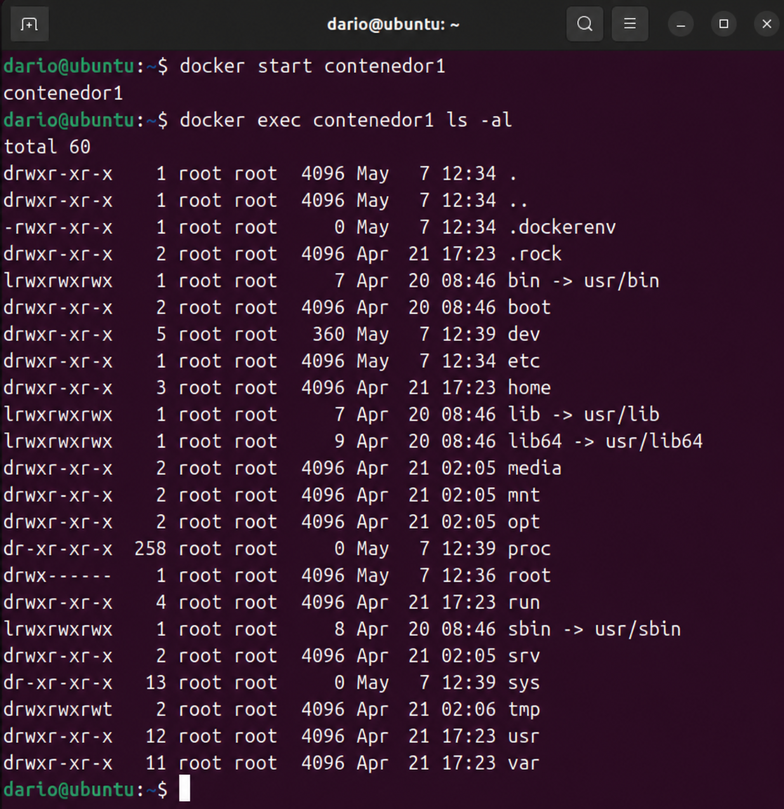

Para obtener informacion detallada sobre la configuracion y el estado del contenedor:

```bash
docker inspect contenedor1
```

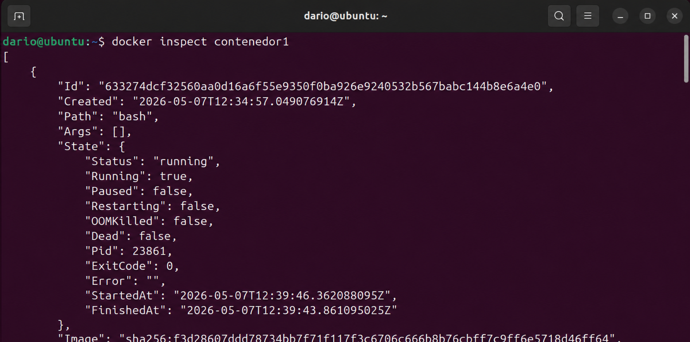

La salida es un objeto JSON que incluye, entre otros datos:
- El identificador completo del contenedor
- La imagen y el comando que se ejecuto al iniciarlo
- Los puertos expuestos y sus redirecciones al anfitrion
- Los montajes (bind mounts y volumenes)
- La configuracion de red del contenedor

---

## 4. Contenedor demonio (segundo plano)

Un contenedor demonio se ejecuta en segundo plano de forma continua. Se lanza con la opcion `-d`, lo que devuelve el control a la terminal inmediatamente despues del inicio.

```bash
docker run -d --name contenedor2 ubuntu bash -c "while true; do echo hello world; sleep 1; done"
```

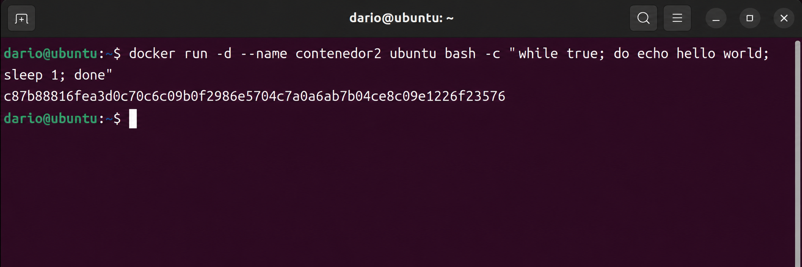

El comando `bash -c` permite ejecutar una cadena como instruccion de shell. En este caso, el bucle infinito imprime `hello world` cada segundo, simulando el comportamiento de un servicio en ejecucion continua.

Para comprobar que el contenedor sigue activo:

```bash
docker ps
```

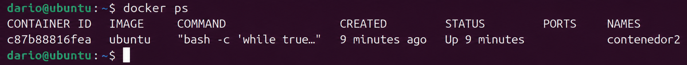

Para ver la salida que esta generando el contenedor:

```bash
docker logs contenedor2
```

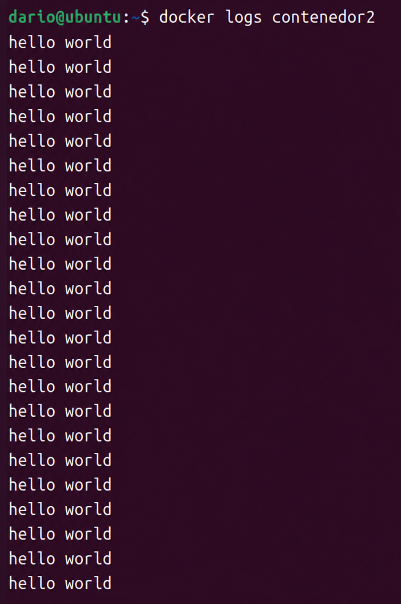

Se puede observar como el bucle ha estado escribiendo lineas desde el inicio. Con `docker logs -f` se puede seguir el log en tiempo real.

Para detener el contenedor y eliminarlo:

```bash
docker stop contenedor2
docker rm contenedor2
```

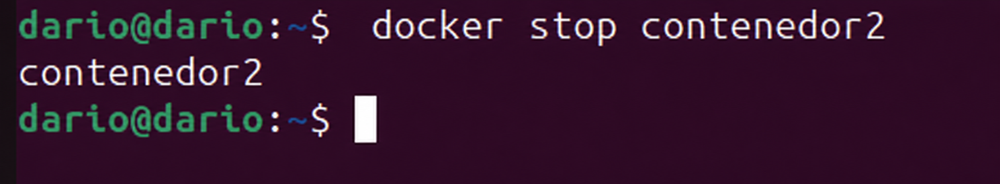

Es importante respetar el orden: primero detener, luego eliminar. Si se quiere forzar la eliminacion sin parar antes el contenedor, se puede usar:

```bash
docker rm -f contenedor2
```

---

## 5. Contenedor con servidor web

Docker Hub dispone de imagenes oficiales para servicios comunes. En este ejemplo se usa la imagen `httpd:2.4` para levantar un servidor Apache en un contenedor, publicando el puerto 80 del contenedor en el puerto 8081 del anfitrion:

```bash
docker run -d --name my-apache-app -p 8081:80 httpd:2.4
```

El mapeo de puertos `-p 8081:80` indica que el trafico que llegue al puerto 8081 del anfitrion se redirige al puerto 80 del contenedor.

Accediendo desde el navegador a `http://127.0.0.1:8081` se comprueba que el servidor esta operativo:

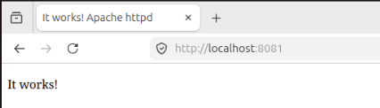

Para revisar los logs de acceso del servidor:

```bash
docker logs my-apache-app
```

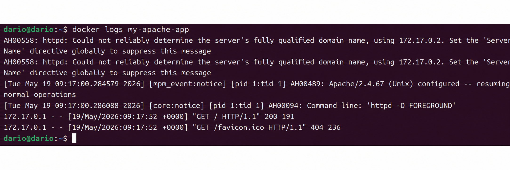

### Modificacion del contenido servido

El directorio raiz de Apache dentro del contenedor `httpd:2.4` es `/usr/local/apache2/htdocs/`. Hay dos formas de modificar el contenido.

**Metodo 1: accediendo al contenedor de forma interactiva**

```bash
docker exec -it my-apache-app bash
cd /usr/local/apache2/htdocs/
echo "<h1>Curso Docker</h1>" > index.html
exit
```

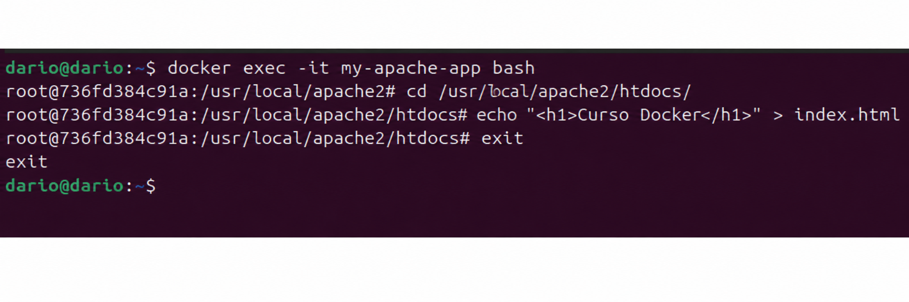

**Metodo 2: ejecutando el comando directamente desde fuera**

```bash
docker exec my-apache-app bash -c 'echo "<h1>Curso Docker</h1>" > /usr/local/apache2/htdocs/index.html'
```

Tras realizar cualquiera de los dos metodos, al recargar el navegador se puede ver el nuevo contenido:

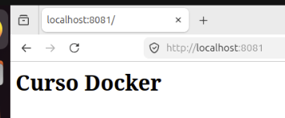

---

## 6. Configuracion de contenedores con variables de entorno

Las variables de entorno permiten parametrizar el comportamiento de los contenedores en el momento de su creacion. Se pasan con la opcion `-e` o `--env`.

```bash
docker run -it --name prueba -e USUARIO=prueba ubuntu bash
```

Una vez dentro del contenedor, se puede verificar que la variable esta disponible:

```bash
echo $USUARIO
```

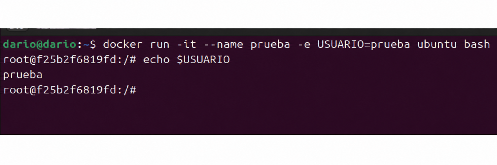

### Configuracion de MariaDB con variables de entorno

Algunas imagenes requieren variables de entorno obligatorias para poder iniciarse. La imagen oficial de MariaDB exige que se defina al menos `MARIADB_ROOT_PASSWORD`. Tambien admite variables opcionales como `MARIADB_DATABASE`, `MARIADB_USER` o `MARIADB_PASSWORD`.

```bash
docker run -d --name some-mariadb -e MARIADB_ROOT_PASSWORD=my-secret-pw mariadb
```

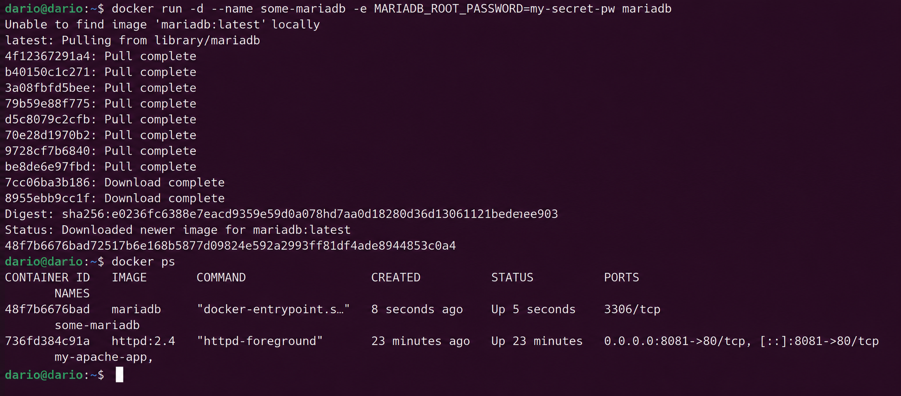

Para listar todas las variables de entorno activas dentro del contenedor:

```bash
docker exec -it some-mariadb env
```

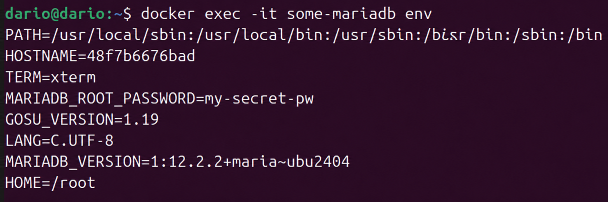

Se puede observar que la imagen define automaticamente otras variables ademas de la que hemos indicado.

Para acceder al shell del contenedor:

```bash
docker exec -it some-mariadb bash
```

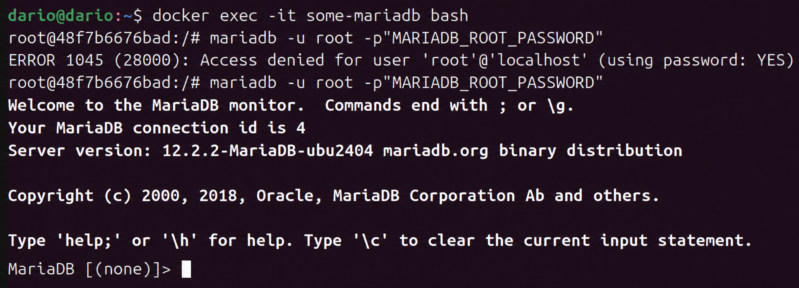

Una alternativa es conectarse directamente al cliente de MariaDB desde fuera del contenedor:

```bash
docker exec -it some-mariadb mariadb -u root -p
```

Al solicitar la contrasena, se introduce la que se definio con `MARIADB_ROOT_PASSWORD`:

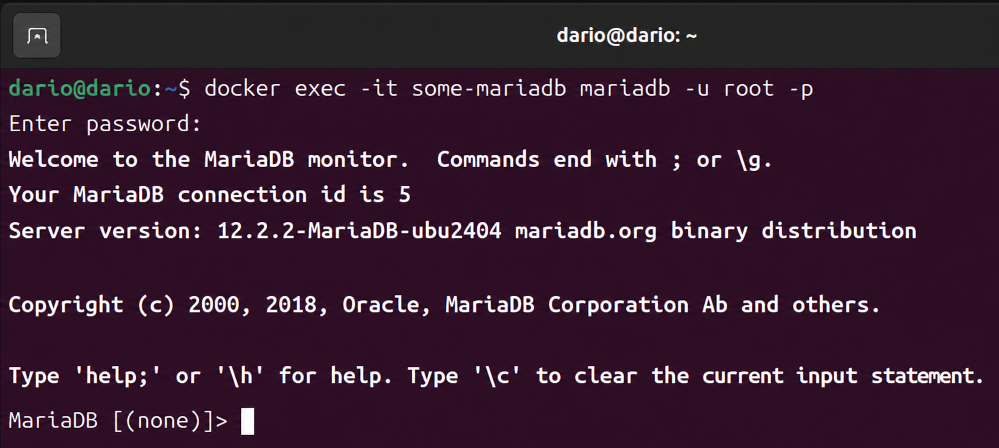

### Acceso externo al servidor de base de datos

Para permitir conexiones desde fuera del contenedor se mapea el puerto 3306:

```bash
docker run -d -p 3306:3306 --name some-mariadb -e MARIADB_ROOT_PASSWORD=my-secret-pw mariadb
```

Se verifica que el contenedor esta corriendo y el puerto esta correctamente mapeado:

```bash
docker ps
```

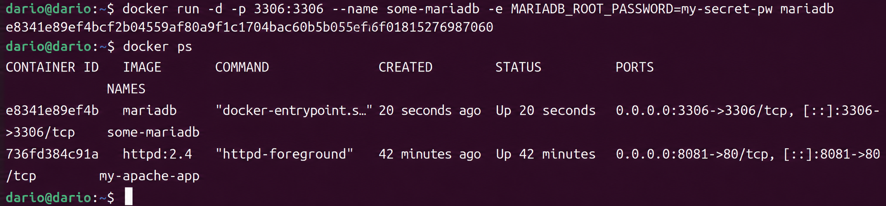

Desde el equipo anfitrion (con el cliente de MySQL o MariaDB instalado) se puede conectar directamente:

```bash
mysql -u root -p -h 127.0.0.1
```

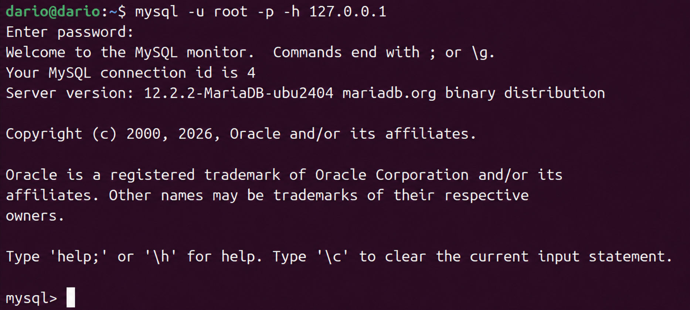

Esta es una de las caracteristicas mas utiles de Docker: el contenedor expone el servicio de base de datos como si estuviera instalado localmente, sin necesidad de instalar MariaDB en el anfitrion.
