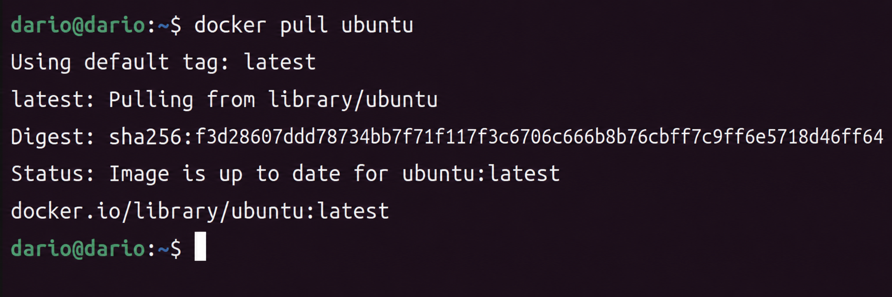
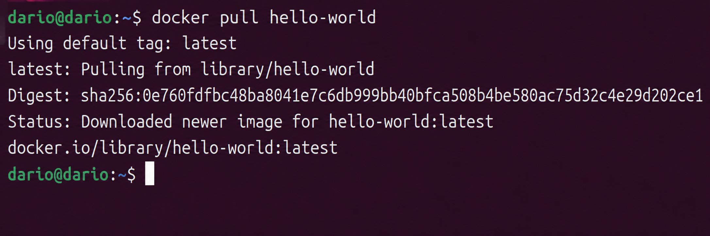
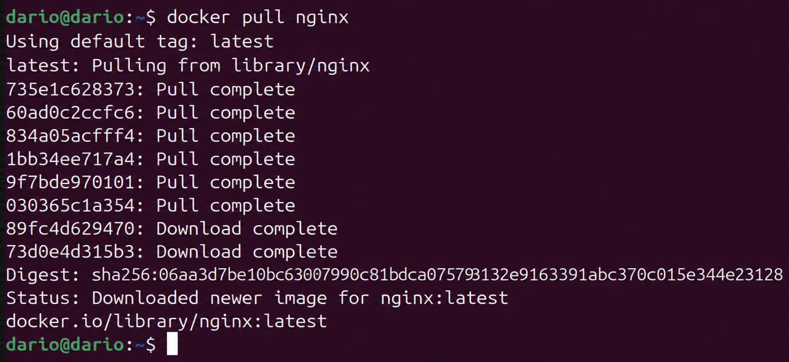
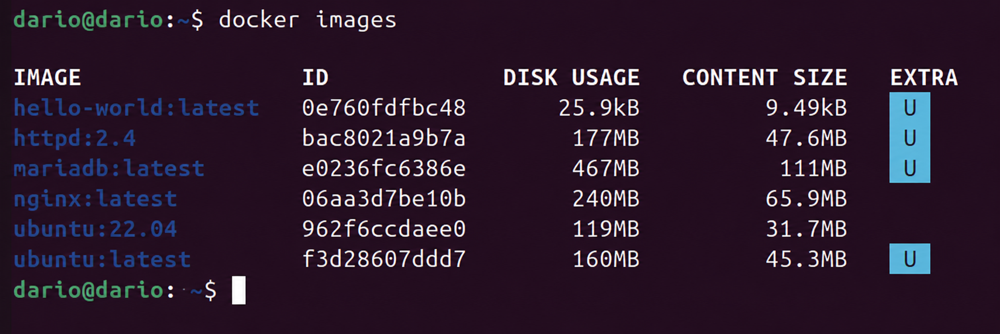
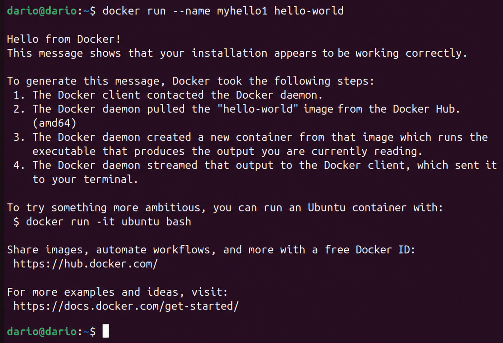
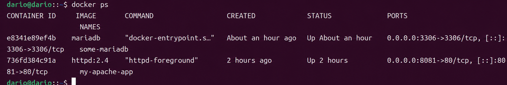
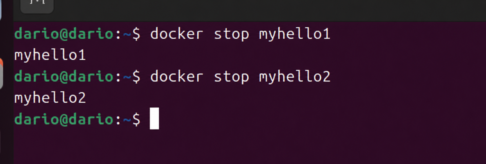
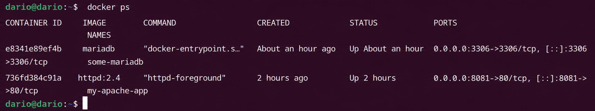

# Actividad 3 - Gestion de imagenes y contenedores en Docker

## Introduccion

En esta actividad se trabaja con los comandos fundamentales de Docker para gestionar **imagenes** y **contenedores**. La diferencia entre ambos conceptos es clave: una imagen es una plantilla de solo lectura que define el sistema de ficheros y la configuracion de una aplicacion, mientras que un contenedor es una instancia en ejecucion de dicha imagen. Pueden existir multiples contenedores basados en la misma imagen, cada uno con su propio estado y nombre.

Los pasos cubren el ciclo de vida completo: descarga de imagenes desde Docker Hub, ejecucion de contenedores con nombre personalizado, inspeccion del estado del sistema, detencion selectiva y eliminacion de contenedores.

---

## Paso 1 - Descargar la imagen de Ubuntu

El comando `docker pull` descarga una imagen desde el registro de Docker Hub sin ejecutarla. En este caso se descarga la imagen oficial de Ubuntu, que incluye el sistema base del sistema operativo.

```bash
docker pull ubuntu
```

Docker comprueba si la imagen ya existe localmente. Si no es asi, descarga cada capa por separado. La etiqueta `latest` se aplica por defecto cuando no se especifica ninguna version concreta.

**Captura:**



---

## Paso 2 - Descargar la imagen de hello-world

`hello-world` es la imagen de prueba oficial de Docker. Su unico proposito es confirmar que la instalacion de Docker funciona correctamente: cuando se ejecuta, imprime un mensaje de verificacion y termina.

```bash
docker pull hello-world
```

Al ser una imagen muy ligera, la descarga es practicamente instantanea.

**Captura:**



---

## Paso 3 - Descargar la imagen de Nginx

Nginx es un servidor web y proxy inverso ampliamente utilizado. Descargar su imagen permite disponer de un servidor HTTP listo para ejecutarse en un contenedor sin necesidad de instalacion manual en el sistema anfitron.

```bash
docker pull nginx
```

Docker descarga la imagen oficial de Nginx desde Docker Hub junto con todas sus capas de dependencias.

**Captura:**



---

## Paso 4 - Listar todas las imagenes descargadas

Una vez descargadas las tres imagenes, se puede verificar que estan disponibles localmente con el siguiente comando:

```bash
docker images
```

La salida muestra el nombre del repositorio, la etiqueta (`TAG`), el identificador unico de la imagen (`IMAGE ID`), la fecha de creacion y el tamano en disco. Deben aparecer `ubuntu`, `hello-world` y `nginx`.

**Captura:**



---

## Paso 5 - Ejecutar un contenedor hello-world con nombre "myhello1"

El parametro `--name` permite asignar un nombre legible al contenedor en lugar del identificador aleatorio que Docker genera por defecto. Esto facilita referenciar el contenedor en operaciones posteriores como detenerlo o eliminarlo.

```bash
docker run --name myhello1 hello-world
```

El contenedor se crea, ejecuta el proceso interno (que imprime el mensaje de verificacion), y finaliza de forma automatica. Que un contenedor termine no significa que haya sido eliminado: sigue existiendo en estado `Exited` y puede inspeccionarse o eliminarse.

**Captura:**



---

## Paso 6 - Ejecutar un contenedor hello-world con nombre "myhello2"

Se lanza un segundo contenedor basado en la misma imagen `hello-world`. Al usar `--name myhello2` se crea una instancia completamente independiente de `myhello1`, aunque ambas comparten la misma imagen subyacente.

```bash
docker run --name myhello2 hello-world
```

Este comando no requiere captura adicional ya que el comportamiento es identico al del paso anterior, con la unica diferencia del nombre asignado.

---

## Paso 7 - Ejecutar un contenedor hello-world con nombre "myhello3"

Se repite el proceso para obtener un tercer contenedor con nombre diferente:

```bash
docker run --name myhello3 hello-world
```

Con esto se tienen tres contenedores (`myhello1`, `myhello2`, `myhello3`) todos en estado `Exited`, ya que `hello-world` no mantiene un proceso en segundo plano.

---

## Paso 8 - Mostrar los contenedores en ejecucion

El comando `docker ps` muestra unicamente los contenedores que se encuentran activos en ese momento:

```bash
docker ps
```

La lista aparece vacia o sin los contenedores `myhello*`, ya que `hello-world` termina su ejecucion inmediatamente despues de mostrar el mensaje. Para ver todos los contenedores (incluyendo los que han terminado) se usaria `docker ps -a`.

**Captura:**



---

## Paso 9 - Detener el contenedor "myhello1"

Aunque `hello-world` ya ha terminado por si solo, el ejercicio practica el uso de `docker stop` para detener contenedores de forma explicita. Este comando envia la senal `SIGTERM` al proceso principal del contenedor, esperando hasta 10 segundos antes de forzar la parada con `SIGKILL`.

```bash
docker stop myhello1
```

---

## Paso 10 - Detener el contenedor "myhello2"

Se aplica el mismo procedimiento al segundo contenedor:

```bash
docker stop myhello2
```

**Captura de los pasos 9 y 10:**



---

## Paso 11 - Eliminar el contenedor "myhello1"

`docker rm` elimina definitivamente un contenedor. A diferencia de detenerlo, esta operacion no se puede deshacer. El contenedor debe estar detenido antes de poder eliminarlo (o usar la opcion `-f` para forzarlo).

```bash
docker rm myhello1
```

Si el comando tiene exito, Docker devuelve el nombre del contenedor eliminado como confirmacion.

**Captura:**



---

## Paso 12 - Mostrar de nuevo los contenedores en ejecucion

Se repite la comprobacion del estado del sistema tras haber eliminado `myhello1`:

```bash
docker ps
```

El resultado sigue mostrando la lista vacia de contenedores activos. Para confirmar que `myhello1` ya no existe y que `myhello2` y `myhello3` permanecen en estado `Exited`, se podria ejecutar `docker ps -a`, donde se observaria que `myhello1` ha desaparecido del listado.

---

## Paso 13 - Eliminar todos los contenedores restantes

Para limpiar completamente el entorno se eliminan los contenedores que quedan. Dado que `myhello2` y `myhello3` estan detenidos, se pueden borrar directamente:

```bash
docker rm myhello2
docker rm myhello3
```

Si hubiera contenedores en ejecucion, primero habria que detenerlos con `docker stop` antes de eliminarlos. Una vez completado este paso, el sistema queda sin contenedores activos ni detenidos relacionados con esta actividad.

Para verificarlo:

```bash
docker ps -a
```

La salida deberia estar vacia o no mostrar ninguno de los contenedores creados en esta actividad.

---

## Resumen de comandos utilizados

| Comando | Descripcion |
|---|---|
| `docker pull <imagen>` | Descarga una imagen desde Docker Hub |
| `docker images` | Lista todas las imagenes disponibles localmente |
| `docker run --name <nombre> <imagen>` | Crea y ejecuta un contenedor con nombre personalizado |
| `docker ps` | Lista los contenedores activos en este momento |
| `docker ps -a` | Lista todos los contenedores, incluidos los detenidos |
| `docker stop <nombre>` | Detiene un contenedor en ejecucion |
| `docker rm <nombre>` | Elimina un contenedor detenido |
