# Practica 5 - Escenarios multicontenedor con Docker Compose

## Introduccion

Hasta ahora habiamos levantado cada contenedor de forma individual usando `docker run`, lo que implica gestionar manualmente las redes, los volumenes y el orden de arranque. Cuando una aplicacion necesita varios contenedores que deben comunicarse entre si, ese proceso se vuelve tedioso y propenso a errores.

**Docker Compose** soluciona este problema permitiendo describir toda la infraestructura de una aplicacion en un unico fichero YAML (`docker-compose.yaml`). Con un solo comando es posible crear, iniciar, detener y eliminar todos los contenedores del escenario junto con sus redes y volumenes.

En esta practica se documentan tres ejemplos del modulo 4 del curso de Docker.

---

## Ejemplo 1: Aplicacion Guestbook

### Descripcion

Guestbook es una aplicacion web sencilla de libro de visitas que almacena los mensajes en una base de datos Redis. Consta de dos servicios: la aplicacion Python (`iesgn/guestbook`) y el servidor Redis. En la Actividad 3 se levanto manualmente; aqui se hace lo mismo pero mediante Compose, lo que demuestra la ventaja de tener toda la infraestructura declarada en un unico fichero.

### Creacion del directorio y el fichero

Se crea un directorio de trabajo y dentro el fichero de definicion:

```bash
mkdir guestbook
cd guestbook
nano docker-compose.yaml
```

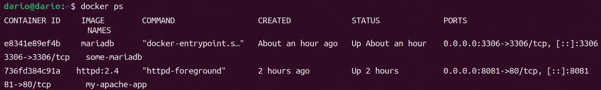

### Fichero docker-compose.yaml

```yaml
version: '3.1'
services:
  app:
    container_name: guestbook
    image: iesgn/guestbook
    restart: always
    environment:
      REDIS_SERVER: redis
    ports:
      - 8080:5000
  db:
    container_name: redis
    image: redis
    restart: always
    command: redis-server --appendonly yes
    volumes:
      - redis:/data
volumes:
  redis:
```

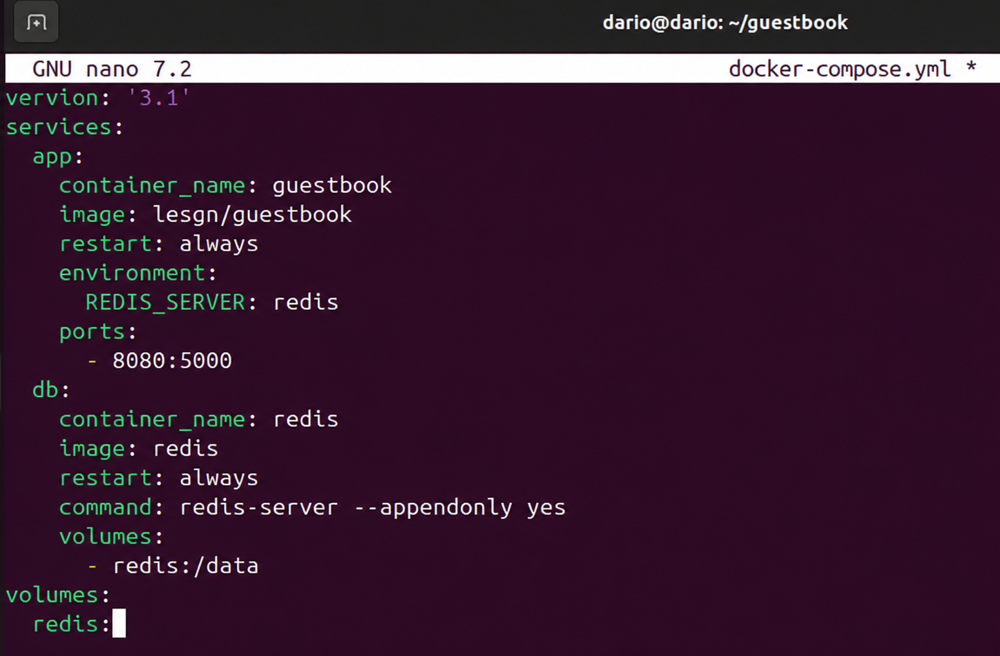

Aspectos importantes de esta configuracion:

- `REDIS_SERVER: redis` indica a la aplicacion la direccion del servidor Redis. Docker Compose crea automaticamente una red interna y asigna como hostname de cada contenedor tanto el nombre del servicio como el del contenedor, por lo que la resolucion funciona correctamente.
- `command: redis-server --appendonly yes` sobreescribe el comando de inicio del contenedor para activar la persistencia en disco. Sin este flag, Redis perderia todos los datos al reiniciar.
- Se declara un volumen Docker llamado `redis` que monta en `/data`. A diferencia de un bind mount, Docker gestiona su ubicacion en el sistema de ficheros del host, lo que simplifica el despliegue.
- `restart: always` hace que Docker reinicie el contenedor automaticamente si cae por cualquier motivo.

### Despliegue

Para crear y arrancar todos los contenedores en segundo plano:

```bash
docker compose up -d
```

Docker descarga las imagenes si no estan en local, crea la red, el volumen y los contenedores, y los inicia en el orden correcto.

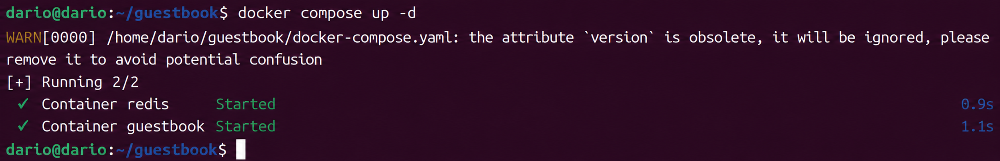

Para verificar el estado de los contenedores del escenario:

```bash
docker compose ps
```

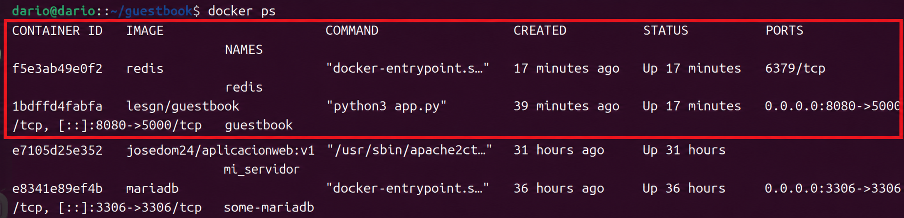

Accediendo a `http://localhost:8080` desde el navegador se puede comprobar que la aplicacion responde correctamente y permite introducir mensajes.


### Gestion del escenario

Para detener los contenedores sin eliminarlos:

```bash
docker compose stop
```

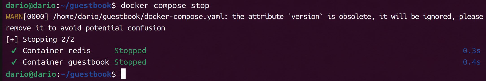

Para eliminar completamente el escenario (contenedores y red):

```bash
docker compose down
```

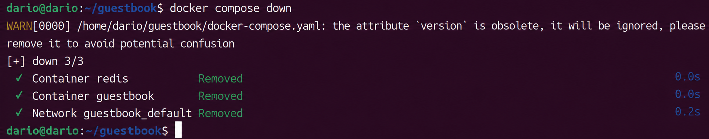

Si ademas se quieren borrar los volumenes: `docker compose down -v`

---

## Ejemplo 2: Aplicacion Temperaturas

### Descripcion

La aplicacion Temperaturas esta formada por dos servicios independientes: un frontend en Node.js que recibe las peticiones del usuario y un backend que consulta una API meteorologica externa. Ambos contenedores deben comunicarse entre si, y el frontend no tiene sentido si el backend no esta disponible.

Este ejemplo ilustra el uso de `depends_on` para controlar el orden de arranque y el uso de variables de entorno para comunicar los servicios.

### Fichero docker-compose.yaml

```yaml
services:
  frontend:
    container_name: temperaturas-frontend
    image: iesgn/temperaturas_frontend
    restart: always
    ports:
      - 8081:3000
    environment:
      TEMP_SERVER: temperaturas-backend:5000
    depends_on:
      - backend
  backend:
    container_name: temperaturas-backend
    image: iesgn/temperaturas_backend
    restart: always
```

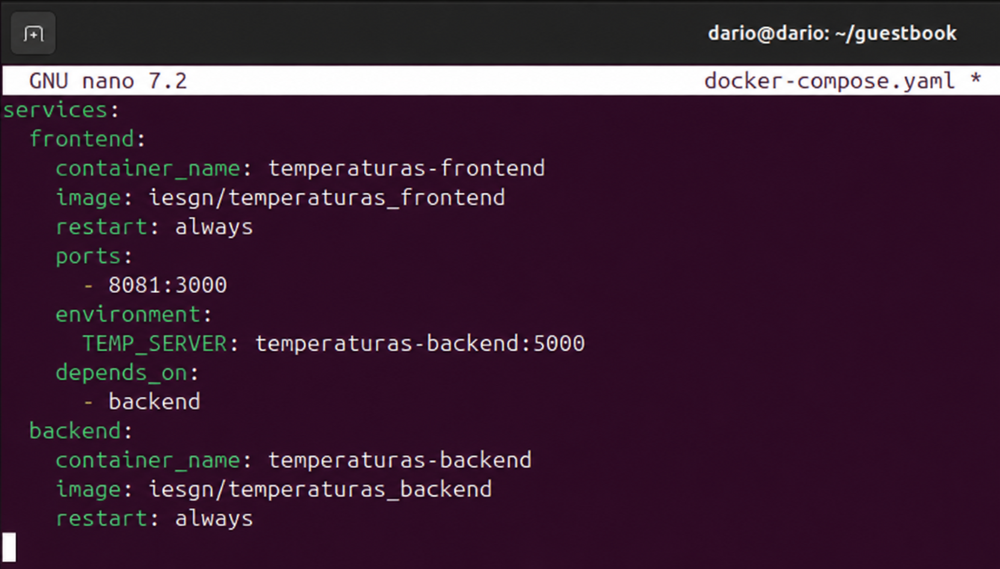

Aspectos importantes:

- `depends_on: backend` garantiza que Compose arranque el servicio `backend` antes que el `frontend`. Sin esta directiva, el frontend podria intentar conectarse al backend antes de que este listo.
- `TEMP_SERVER: temperaturas-backend:5000` especifica la direccion del backend usando el nombre del contenedor. Tambien se podria usar el nombre del servicio (`backend:5000`) ya que ambos son resolubles dentro de la red interna del Compose.
- El backend no expone puertos al exterior porque solo necesita ser accesible desde el frontend dentro de la red interna. Esto reduce la superficie de exposicion.
- Esta aplicacion no necesita volumenes porque no persiste datos propios; las consultas meteorologicas se resuelven contra una API externa.

### Despliegue

```bash
docker compose up -d
```

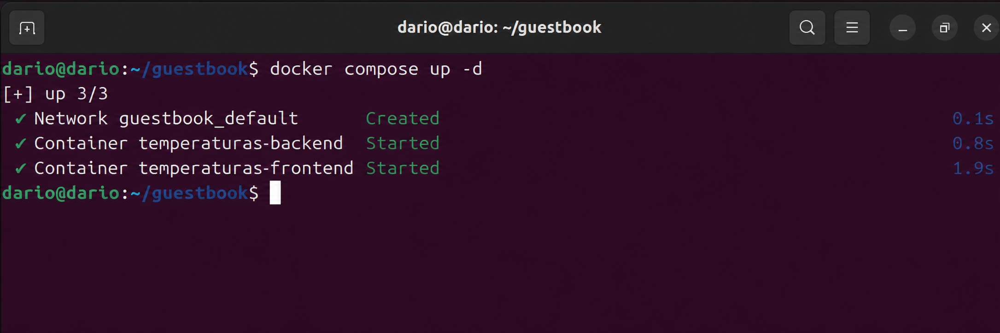

```bash
docker compose ps
```

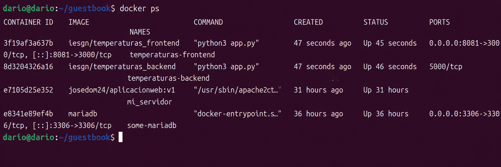

Accediendo a `http://localhost:8081` se puede introducir el nombre de una ciudad y obtener la temperatura actual.


### Limpieza del escenario

```bash
docker compose down
```

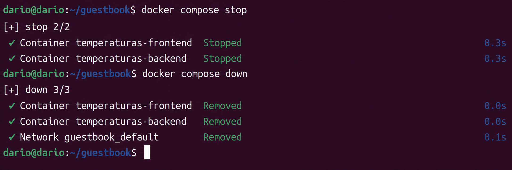

---

## Ejemplo 3: WordPress con MariaDB

### Descripcion

WordPress es un sistema de gestion de contenidos que requiere una base de datos relacional. En este ejemplo se despliega junto a MariaDB usando Docker Compose, demostrando como gestionar datos persistentes entre reinicios y como pasar credenciales entre servicios mediante variables de entorno.

Se muestran dos variantes de almacenamiento para ilustrar la diferencia entre **volumenes Docker** y **bind mounts**.

### Opcion A: Volumenes Docker

```yaml
services:
  wordpress:
    container_name: servidor_wp
    image: wordpress
    restart: always
    environment:
      WORDPRESS_DB_HOST: db
      WORDPRESS_DB_USER: user_wp
      WORDPRESS_DB_PASSWORD: asdasd
      WORDPRESS_DB_NAME: bd_wp
    ports:
      - 8082:80
    volumes:
      - wordpress_data:/var/www/html/wp-content
    depends_on:
      - db
  db:
    container_name: servidor_mysql
    image: mariadb
    restart: always
    environment:
      MYSQL_DATABASE: bd_wp
      MYSQL_USER: user_wp
      MYSQL_PASSWORD: asdasd
      MYSQL_ROOT_PASSWORD: asdasd
    volumes:
      - mariadb_data:/var/lib/mysql
volumes:
  wordpress_data:
  mariadb_data:
```

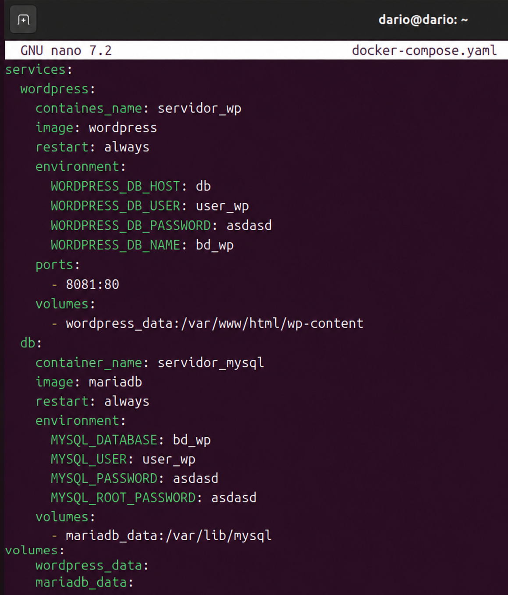

Aspectos importantes:

- Las variables de entorno de WordPress (`WORDPRESS_DB_*`) deben coincidir exactamente con las de MariaDB (`MYSQL_DATABASE`, `MYSQL_USER`, `MYSQL_PASSWORD`). Si no coinciden, la conexion fallara al arrancar.
- `WORDPRESS_DB_HOST: db` usa el nombre del servicio como hostname, que Docker Compose resuelve internamente. El puerto 3306 de MariaDB no se expone al host porque WordPress accede directamente a traves de la red interna.
- Se usan dos volumenes Docker distintos: `wordpress_data` para el contenido del sitio (temas, plugins, subidas) y `mariadb_data` para los datos de la base de datos. Esto asegura que los datos sobreviven a un `docker compose down`.
- Se añade `depends_on: db` para que WordPress no intente conectarse a la base de datos antes de que el contenedor este levantado.

### Opcion B: Bind mounts

```yaml
services:
  wordpress:
    container_name: servidor_wp
    image: wordpress
    restart: always
    environment:
      WORDPRESS_DB_HOST: db
      WORDPRESS_DB_USER: user_wp
      WORDPRESS_DB_PASSWORD: asdasd
      WORDPRESS_DB_NAME: bd_wp
    ports:
      - 8082:80
    volumes:
      - ./wordpress:/var/www/html/wp-content
    depends_on:
      - db
  db:
    container_name: servidor_mysql
    image: mariadb
    restart: always
    environment:
      MYSQL_DATABASE: bd_wp
      MYSQL_USER: user_wp
      MYSQL_PASSWORD: asdasd
      MYSQL_ROOT_PASSWORD: asdasd
    volumes:
      - ./mysql:/var/lib/mysql
```

La diferencia respecto a la Opcion A es que los datos se guardan en subdirectorios locales (`./wordpress` y `./mysql`) relativos al directorio donde se ejecuta Compose. Esto facilita inspeccionar o copiar los datos directamente desde el host sin necesidad de comandos adicionales de Docker, aunque hace el despliegue mas dependiente del sistema de ficheros del host.

### Despliegue

```bash
docker compose up -d
```

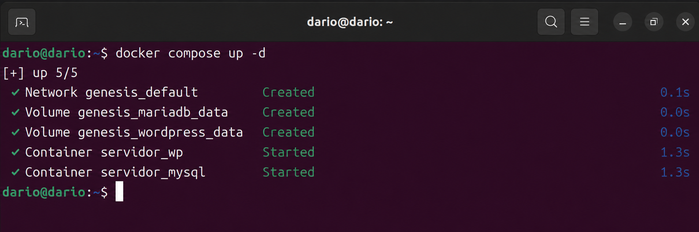

```bash
docker compose ps
```

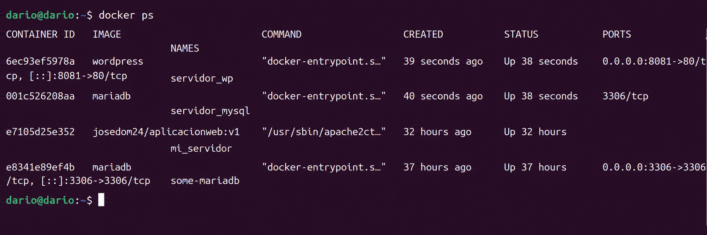

Accediendo a `http://localhost:8082` aparece el asistente de instalacion de WordPress, lo que confirma que la conexion entre el contenedor de WordPress y el de MariaDB se ha establecido correctamente.

### Limpieza del escenario

Para detener y eliminar los contenedores:

```bash
docker compose stop
docker compose rm
```

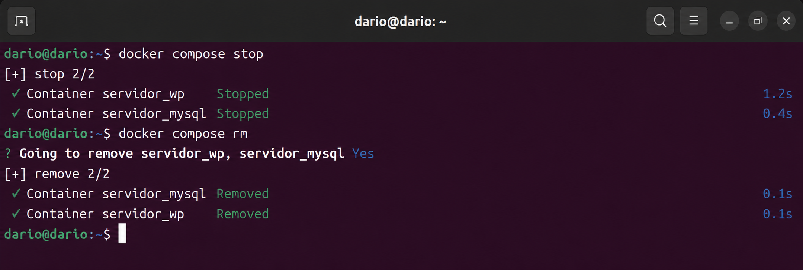

Para eliminar el escenario completo incluyendo volumenes:

```bash
docker compose down -v
```

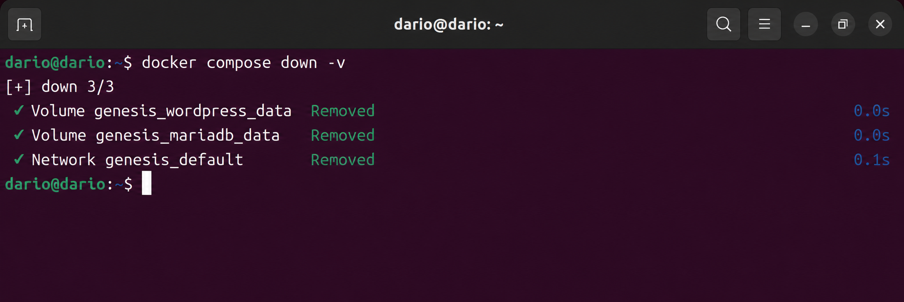

---

## Conclusiones

Los tres ejemplos muestran como Docker Compose simplifica de forma significativa la gestion de escenarios multicontenedor:

- El fichero `docker-compose.yaml` actua como documentacion viva de la infraestructura: con solo leerlo se entiende que servicios componen la aplicacion, como se comunican y donde persisten sus datos.
- La resolucion de nombres por servicio dentro de la red interna elimina la necesidad de conocer IPs de antemano, haciendo los ficheros portables entre maquinas.
- Las directivas `depends_on`, `restart` y `volumes` cubren los casos mas comunes de gestion de ciclo de vida que antes requeriran scripts manuales.
- La diferencia entre volumenes Docker y bind mounts es relevante segun el caso de uso: los primeros son preferibles en produccion por su gestion centralizada; los segundos son utiles en desarrollo cuando se necesita acceso directo a los ficheros.
