# Docker - Práctica 6: Creación de imágenes Docker

## Introducción

En esta práctica se documentan tres ejemplos de creación de imágenes Docker tomados del módulo cinco del curso [josedom24/curso_docker_ies](https://github.com/josedom24/curso_docker_ies). El objetivo es entender los distintos métodos disponibles para construir imágenes propias: desde la escritura de un `Dockerfile` básico hasta el uso de variables de entorno y la publicación de imágenes en Docker Hub.

---

## Ejemplo 1: Construcción de una imagen con Dockerfile — servidor web Nginx

### Descripción

En este primer ejemplo se crea una imagen personalizada basada en `nginx:alpine` que sirve una página HTML estática. El proceso parte de un `Dockerfile` mínimo, se construye la imagen con `docker build` y se verifica el resultado levantando un contenedor de prueba.

### Estructura del proyecto

```
ejemplo1/
├── Dockerfile
└── public/
    └── index.html
```

### Dockerfile

```dockerfile
FROM nginx:alpine
LABEL maintainer="alumno"
COPY public/ /usr/share/nginx/html/
EXPOSE 80
```

La instrucción `FROM` establece la imagen base. Se usa la variante `alpine` para reducir el tamaño final. `COPY` copia el contenido estático al directorio que Nginx sirve por defecto.

### Pasos realizados

**1. Creación del directorio y el Dockerfile**

Se crea la estructura de carpetas y se escribe el `Dockerfile`.

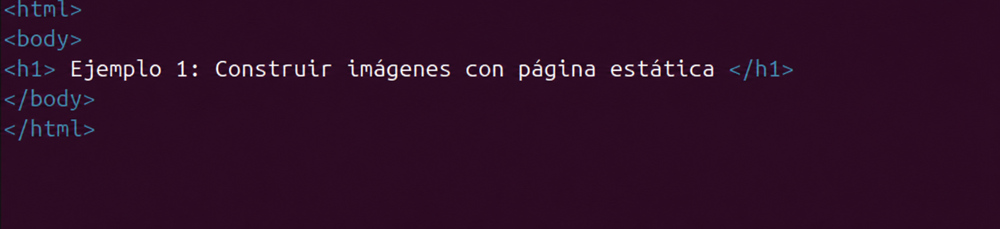

---

**2. Contenido del fichero index.html**

Se añade una página HTML sencilla para comprobar que la imagen sirve contenido correctamente.

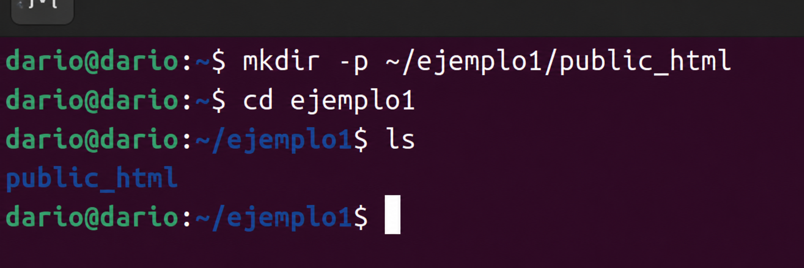

---

**3. Construcción de la imagen con `docker build`**

```bash
docker build -t mi-nginx:v1 .
```

La opción `-t` asigna un nombre y una etiqueta a la imagen resultante.

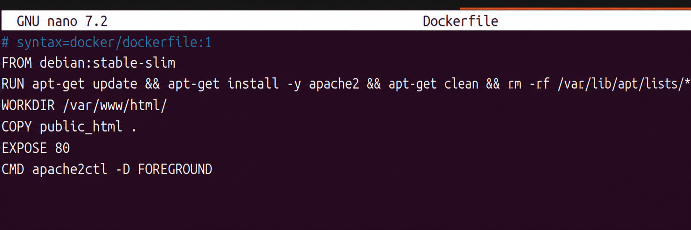

---

**4. Resultado del proceso de construcción**

Docker descarga la imagen base y ejecuta cada instrucción del `Dockerfile` en capas independientes. Al finalizar, la imagen queda disponible en el registro local.

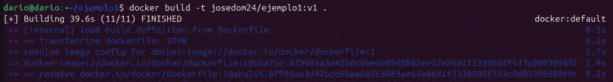

---

**5. Verificación con `docker images`**

```bash
docker images
```

Se comprueba que la imagen `mi-nginx:v1` aparece listada con su tamaño.

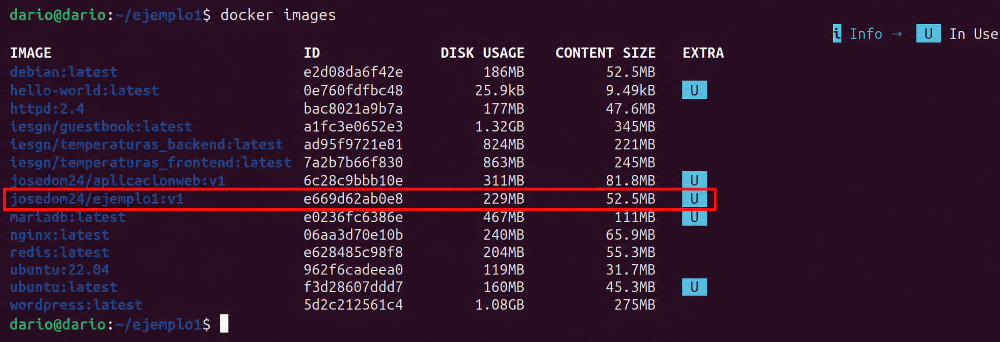

---

**6. Arranque del contenedor de prueba**

```bash
docker run -d --name web-test -p 8080:80 mi-nginx:v1
```

El flag `-d` ejecuta el contenedor en segundo plano y `-p` mapea el puerto 80 del contenedor al puerto 8080 del host.

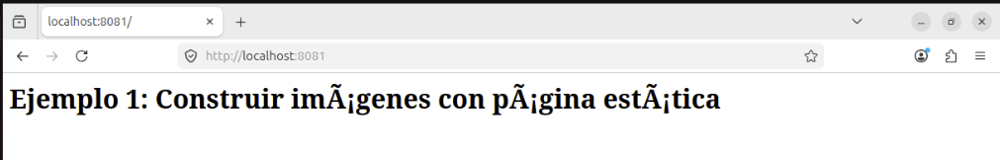

---

**7. Comprobación del contenedor en ejecución**

```bash
docker ps
```

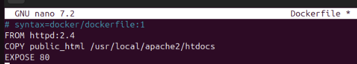

---

**8. Acceso al servicio desde el navegador**

Se abre `http://localhost:8080` y se confirma que la página HTML personalizada se muestra correctamente.

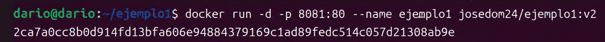

---

**9. Inspección de la imagen**

```bash
docker inspect mi-nginx:v1
```

Se revisa la metadata de la imagen: capas, variables de entorno heredadas, punto de entrada y etiquetas.

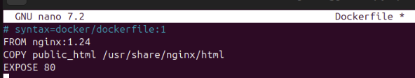

---

**10. Limpieza**

```bash
docker stop web-test && docker rm web-test
```

Se detiene y elimina el contenedor de prueba una vez verificado el funcionamiento.

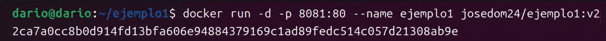

---

## Ejemplo 2: Imagen con una aplicación Python (Flask)

### Descripción

El segundo ejemplo demuestra cómo contenerizar una aplicación web escrita en Python usando el microframework Flask. Se parte de la imagen oficial `python:3.11-slim`, se instalan las dependencias mediante `pip` y se define el comando de inicio con la instrucción `CMD`.

### Estructura del proyecto

```
ejemplo2/
├── Dockerfile
├── requirements.txt
└── app.py
```

### Dockerfile

```dockerfile
FROM python:3.11-slim
WORKDIR /app
COPY requirements.txt .
RUN pip install --no-cache-dir -r requirements.txt
COPY app.py .
ENV FLASK_APP=app.py
EXPOSE 5000
CMD ["flask", "run", "--host=0.0.0.0"]
```

Separar el `COPY` de `requirements.txt` del `COPY` de los ficheros de código aprovecha la caché de capas de Docker: si el código cambia pero las dependencias no, Docker reutiliza la capa de `pip install` sin volver a ejecutarla.

### Pasos realizados

**1. Código de la aplicación Flask**

La aplicación define una única ruta `/` que devuelve un mensaje de texto plano.

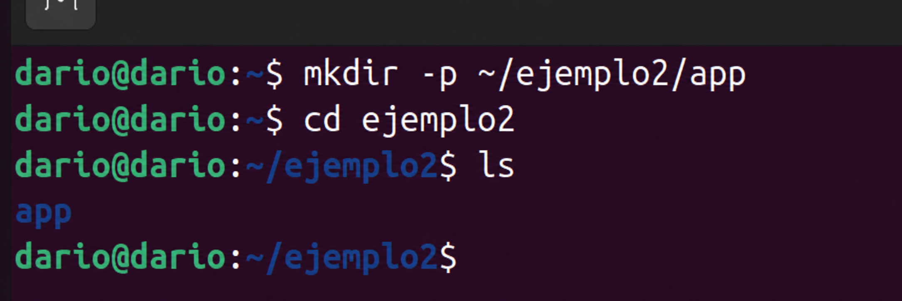

---

**2. Fichero requirements.txt**

Contiene únicamente la dependencia `flask`.

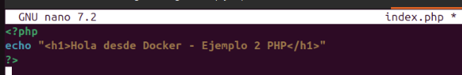

---

**3. Dockerfile completo**

Se muestra el `Dockerfile` antes de construir la imagen.

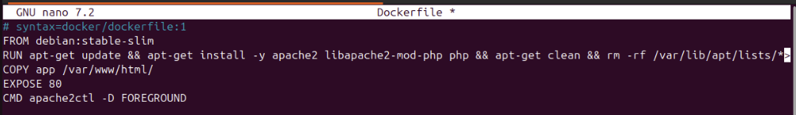

---

**4. Construcción de la imagen**

```bash
docker build -t flask-app:v1 .
```

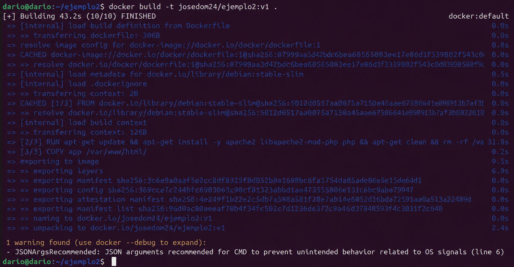

---

**5. Descarga de la imagen base y resolución de dependencias**

Docker descarga `python:3.11-slim` y ejecuta `pip install` instalando Flask y sus dependencias transitivas.

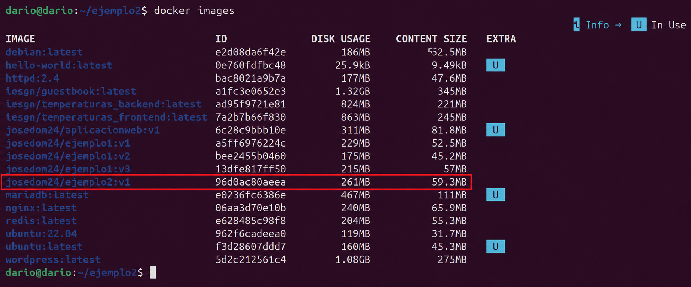

---

**6. Finalización del build**

La imagen se construye correctamente y queda etiquetada como `flask-app:v1`.

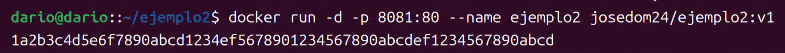

---

**7. Comprobación del tamaño de la imagen**

```bash
docker images flask-app
```

Se compara el tamaño con la imagen base para observar el overhead añadido por las dependencias.

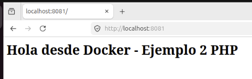

---

**8. Ejecución del contenedor**

```bash
docker run -d --name flask-test -p 5000:5000 flask-app:v1
```

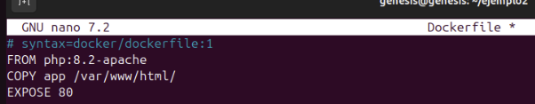

---

**9. Verificación de los logs**

```bash
docker logs flask-test
```

Se comprueba que Flask ha arrancado correctamente y está escuchando en `0.0.0.0:5000`.

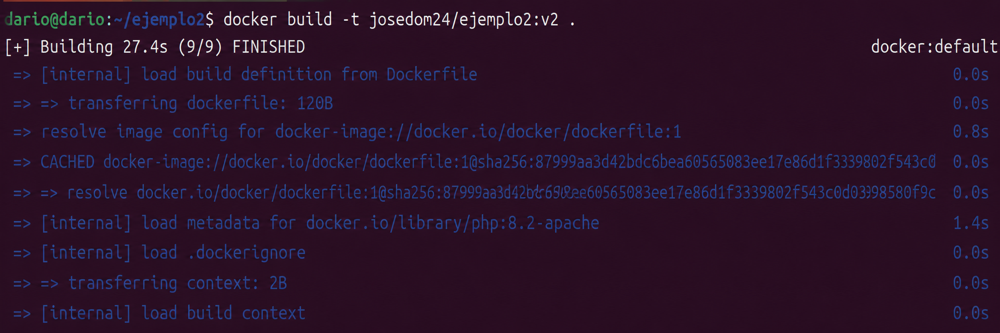

---

**10. Respuesta de la aplicación**

Se realiza una petición con `curl` o desde el navegador para verificar que la aplicación responde.

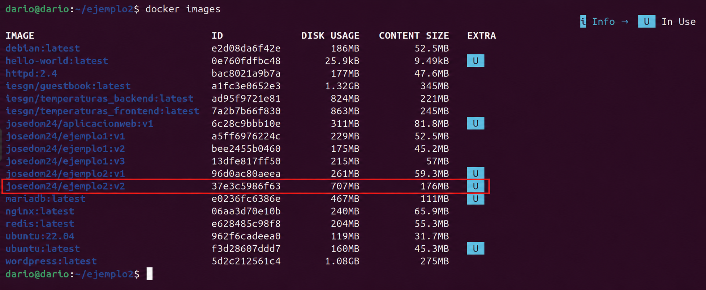

---

**11. Historial de capas de la imagen**

```bash
docker history flask-app:v1
```

Se visualizan las capas que componen la imagen, su tamaño y la instrucción del `Dockerfile` que las generó.

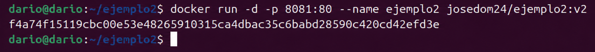

---

**12. Eliminación de la imagen y el contenedor**

```bash
docker stop flask-test && docker rm flask-test
docker rmi flask-app:v1
```

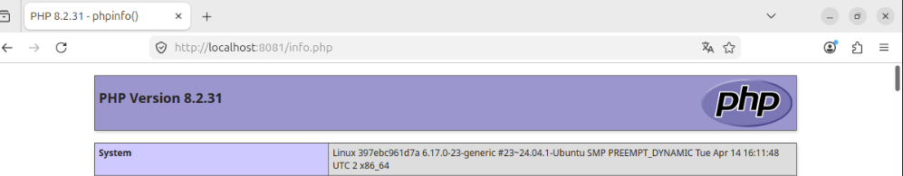

---

## Ejemplo 3: Variables de entorno, volúmenes y publicación en Docker Hub

### Descripción

El tercer ejemplo amplía los conceptos anteriores incorporando variables de entorno configurables en tiempo de ejecución con la instrucción `ENV` y `ARG`, y muestra cómo etiquetar y publicar una imagen en Docker Hub para que pueda ser reutilizada desde cualquier equipo.

### Dockerfile

```dockerfile
FROM nginx:alpine
ARG VERSION=1.0
LABEL version=$VERSION
ENV APP_ENV=production
COPY public/ /usr/share/nginx/html/
HEALTHCHECK --interval=30s --timeout=5s \
  CMD wget -qO- http://localhost || exit 1
EXPOSE 80
```

La instrucción `ARG` permite pasar valores en el momento del build (`--build-arg`), mientras que `ENV` define variables disponibles durante la ejecución del contenedor. `HEALTHCHECK` permite a Docker comprobar periódicamente si el servicio está respondiendo.

### Pasos realizados

**1. Dockerfile con variables de entorno y HEALTHCHECK**

Se muestra el `Dockerfile` completo antes de construir.

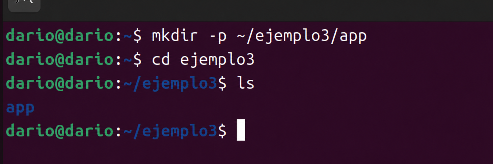

---

**2. Construcción pasando un argumento de build**

```bash
docker build --build-arg VERSION=2.0 -t mi-nginx:v2 .
```

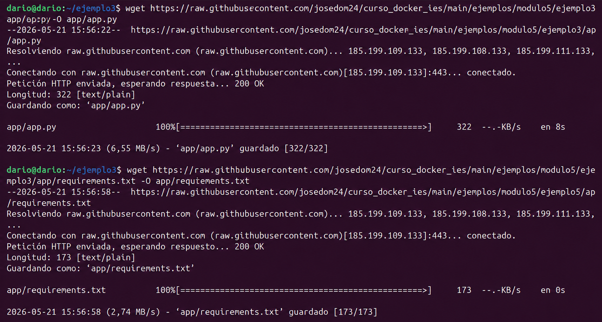

---

**3. Verificación de la etiqueta con `docker inspect`**

Se comprueba que la etiqueta `version=2.0` quedó registrada en la metadata de la imagen.

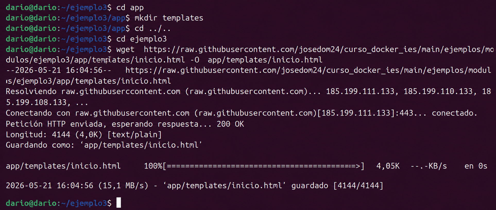

---

**4. Ejecución del contenedor y comprobación del HEALTHCHECK**

```bash
docker run -d --name web-health -p 8081:80 mi-nginx:v2
docker ps
```

Tras unos segundos, el estado del contenedor pasa de `health: starting` a `healthy`.

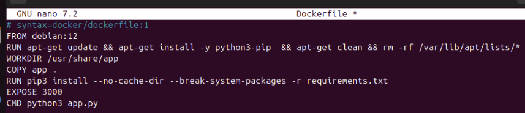

---

**5. Comprobación de la variable de entorno en el contenedor**

```bash
docker exec web-health env | grep APP_ENV
```

Se verifica que la variable `APP_ENV=production` está disponible dentro del contenedor en ejecución.

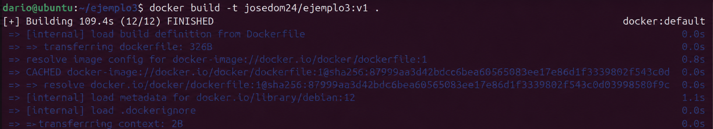

---

**6. Etiquetado de la imagen para Docker Hub**

```bash
docker tag mi-nginx:v2 usuario/mi-nginx:v2
```

Para subir una imagen a Docker Hub es necesario incluir el nombre de usuario del registro como prefijo.

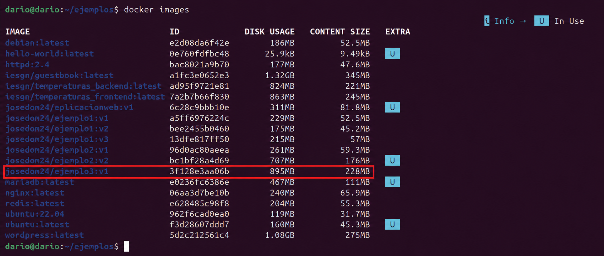

---

**7. Login en Docker Hub**

```bash
docker login
```

Se introduce el nombre de usuario y la contraseña (o token de acceso) para autenticarse contra el registro público.

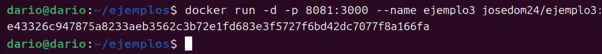

---

**8. Publicación de la imagen**

```bash
docker push usuario/mi-nginx:v2
```

Docker sube únicamente las capas que no estaban ya presentes en el registro, lo que reduce el tiempo de transferencia.

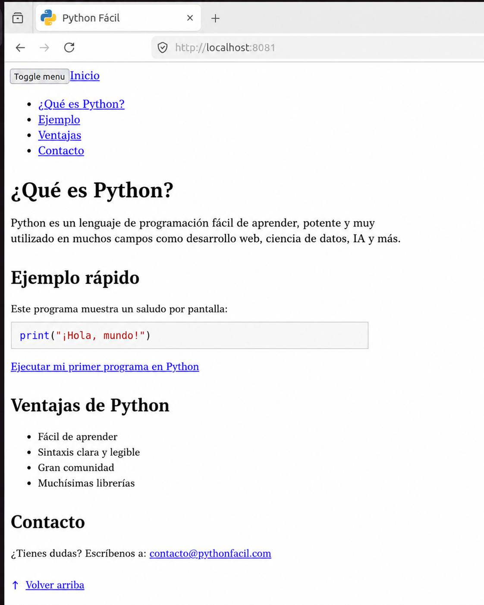

---

**9. Verificación en Docker Hub**

Se accede a la cuenta de Docker Hub y se comprueba que la imagen aparece publicada con la etiqueta correcta y su descripción.

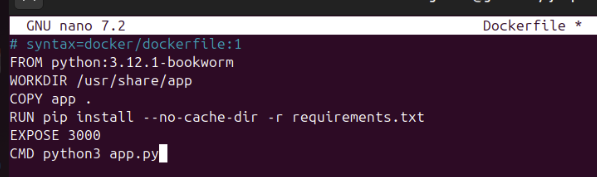

---

## Conclusiones

A lo largo de la práctica se han trabajado tres niveles de complejidad creciente en la creación de imágenes Docker:

- **Ejemplo 1** — Se aprendió a escribir un `Dockerfile` básico con las instrucciones `FROM`, `COPY` y `EXPOSE`, y a construir y ejecutar una imagen de Nginx con contenido estático personalizado.
- **Ejemplo 2** — Se contenerizó una aplicación Python real, comprendiendo la importancia del orden de las instrucciones para aprovechar la caché de capas y reducir los tiempos de build.
- **Ejemplo 3** — Se exploraron instrucciones avanzadas (`ARG`, `ENV`, `HEALTHCHECK`) y el flujo completo de publicación de una imagen en Docker Hub, lo que permite distribuir imágenes propias de forma centralizada.

El módulo cinco del curso queda así cubierto en sus aspectos esenciales: escritura de `Dockerfile`, optimización de capas, configuración en tiempo de ejecución y distribución de imágenes.
